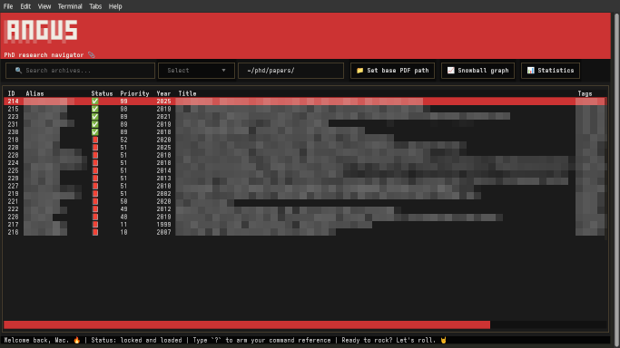

Title: A local, terminal-based tool to manage my PhD research snowballing
Date: 2026-08-15 00:00
Category: Programming

I started my PhD four months ago, which means I'm already drowning in coffee and papers and in desperate need of a tool capable of managing chaos amid snowballing misery. I needed something to track my reading and summarization so I could start bracing for the inevitable calamity of writing my thesis later on.

I found a few tools that met my requirements, but they all demanded subscriptions, and because I didn't want to have to pay rent to do something as simple as organizing a bunch of PDFs and notes, I decided to build my own Python tool using AI-driven programming--I find the term "vibe coding" so stupid--in OpenCode, which I've hooked up to Ollama.

The best part of being a cheap bastard is that I was able to add my own little requirements such as theming the thing after MacGyver--since I'll probably rely on this tool daily in the next couple of years I figured I could at least make it a bit more fun to use--, making it KISS-to-my-taste-compliant, making it entirely local and terminal-based, and adding my own obnoxious functionality such as automatically generating an ASCII snowballing directed graph based on paper entries and having it calculate snowballing statistics to further augment my despair.

Without further ado, ladies and gentlemen, meet...

[Angus](https://codeberg.org/vasconcedu/angus)--a terminal-based, MacGyver-themed research references navigator for the discerning PhD student who engineers his own way. _Ta-da!_

Angus implements a simple TUI based on Python Textual that includes everything that I need to index, prioritize, review, and summarize papers. Its database is just SQLite, which allows me to back it up easily, or query it using a SQLite tool if I ever need to. Angus allows me to specify a local base path where I keep paper PDFs, and to open them in the system's default PDF reader directly from its TUI. Add to that a handful of navigation keybindings, all in all it makes for a very fluid workflow.

Apart from ordinary fields such as titles, authors and publication years, the indexing system automatically creates unique aliases for each paper. Aliases are based on the main author's last name, publication year, and a disambiguation suffix if multiple papers share the same base alias. For instance, the first paper by Eduardo Vasconcelos in 2026 is assigned alias `Vasconcelos2026`. A second paper by any Vasconcelos that same year results in changing that alias to `Vasconcelos2026a` and assigning alias `Vasconcelos2026b` to the new one. I also added tag support for easier paper retrieval. Combined with search and simple filtering functionality, this makes for an effective database navigation system.

As a tool whose primary purpose is to assist in snowballing, Angus also keeps track of references. I'm able to link papers by adding "cites" and "cited by" annotations that point to other papers in the database. The complementary annotation is assigned automatically. That linking system enables the automatic generation of an ASCII snowballing directed graph, something I like to have when I'm snowballing to help me keep track of the process. Before deciding to build Angus, I used to do this with a manually updated draw.io diagram. As I mentioned, I used AI-driven programming in OpenCode to develop Angus, and while this allowed me to obtain a really good result very quickly, I have to point out that this graph generation functionality I wanted required lots of manual intervention. The model I used--`kimi-k2.6` on Ollama's cloud--did a very good job and required very little manual intervention with all the rest, but it got completely lost on this one feature.

Finally, Angus provides statistics about the snowballing process, such as an ASCII plot of the number of papers per publication year.

This was my first time relying on AI so heavily for programming anything useful, and I have to admit that I was surprised that I obtained such good results. I'm a competent Python programmer, but using AI has surely accelerated the development process. I was able to obtain a functional--and rather pretty--tool in a single day's work, and I wouldn't be able to do that if I were programming manually.

As Mac once said: 

> "If you don't have the right equipment for the job, you just have to make it yourself."

_Happy hacking._