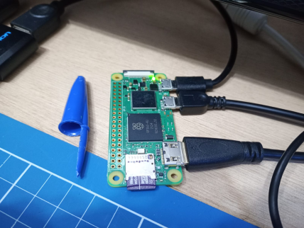
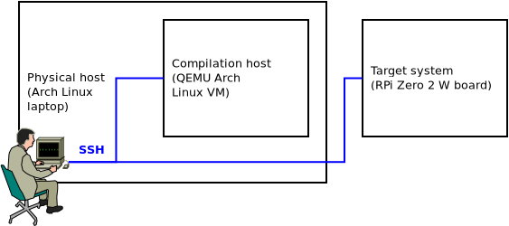
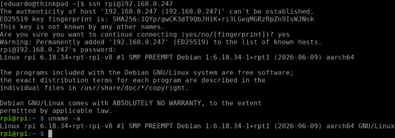
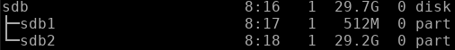
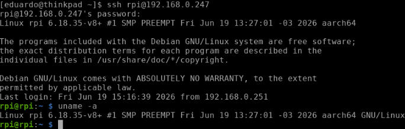
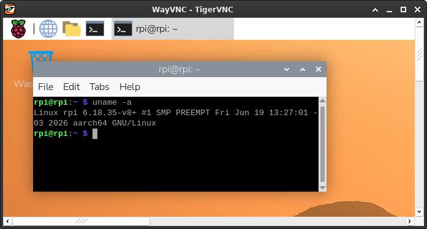

Title: Cross-compiling the Linux kernel for ARM64 on the RPi using a QEMU x86_64 Arch Linux compilation host
Category: Linux
Date: 2026-06-19 15:00


I've been tinkering with the RPi to build a toy example in the context of my PhD research in the last couple of days, trying to get a custom kernel to work on a [Zero 2 W board](https://pip-assets.raspberrypi.com/categories/584-raspberry-pi-zero-2-w/documents/RP-008359-DS-1-raspberry-pi-zero-2-w-product-brief.pdf)--for those unfamiliar with it, here's a picture:

 

As much as [Raspberry Pi's official documentation](https://www.raspberrypi.com/documentation/computers/linux_kernel.html) is very well organized and thorough about the theme of building a custom kernel for RPi boards, as I discussed in [my blog post on setting up a kernel development environment](https://vasconcedu.github.io/linux-kernel-development-setup-in-arch-linux.html), I've chosen Arch Linux as the base distro for my virtualized compilation host, and as the instructions in the official documentation target Debian-based distros--and seem to aim at physical compilation hosts--, I had to MacGyver my way to a functioning cross-compilation setup for the RPi using the virtualized Arch Linux-based setup that I already had. This blog post documents that procedure.

### The cross-compilation scenario herein

Before we begin, it's important to understand that explanations involving cross-compilation scenarios might get rather convoluted to follow, so first of all, let's define our cross-compilation scenario clearly. The figure below shows the three systems involved in our scenario, and where we're positioned:



From the figure, it's easy to realize that three systems are involved in our cross-compilation scenario, namely: a physical host, which happens to be an x86_64 laptop running Arch Linux; a compilation host, which happens to be an x86_64 QEMU Arch Linux VM running on said physical host; and our target system, namely the physical ARM64 RPi Zero 2 W board. It so happens that the RPi board is connected to out lab network, so working from the physical host, we're able to SSH both into the compilation host VM and the RPi board.

Now, of course the RPi boots from a micro SD card containing its boot and root filesystems. In order for us to write to that micro SD card during kernel installation, we'll connect the card to our physical host, and we'll leverage QEMU's virtual filesystem functionality to mount the RPi's filesystem on the micro SD card to a mount point within the compilation host's filesystem. That will allow us to install kernel modules to the RPi's root filesytem. 

Not only that, we'll leverage the fact that our physical host also has access to the micro SD card's mount point to `scp` the kernel image and device tree blobs from the compilation host to the RPi's boot filesystem through the physical host.

Those things we'll become clearer as we advance. For now, the important part is that we understand the different entities that constitute our cross-compilation scenario and their roles.

### Installing the stock Raspberry Pi OS image

First off, we need a functioning RPi system as a starting point. I used the Raspberry Pi OS 64-bit stock image for the Zero 2 W board. In order to install the imager to the Arch Linux physical host, we need to issue:

```bash
sudo pacman -S rpi-imager
```

The process of flashing the stock OS is rather straightforward, but in my experience, it's best to configure the system during the flashing procedure. That will save us time later on when we'll setup the development environment, so it should payoff to setup Wi-Fi connectivity, SSH, and other configurations at this stage.

At least that's what I did, but of course, depending on one's lab infrastructure, one might want to do things differently. In my case, setting up Wi-Fi and SSH a priori was handy because I was able to SSH into the board from my laptop right away after installing the OS, without the need to hook it to peripherals. Alternatively, if one chooses to customize later on, one will be able to change system configurations via the [`raspi-config` utilitary](https://raspberrytips.com/raspi-config-guide/) after logging into the RPi system some other way.

After the flashing procedure is done, we should be able to boot the RPi and SSH into it--of course, we'll need to check in our router what IP address has been assigned to it. Speaking of that, it might also be interesting to assign the RPi a static IP. That said, the system will boot into the stock kernel, as expected:



After booting the RPi to confirm that everything is okay, we can shut it down. We won't use it for now.

### Compiling the kernel for the RPi Zero 2 W

After flashing the stock system, it's time to start the compilation VM on QEMU and prepare to compile the kernel for the Zero 2 W. Again, [my previous blog post about setting up a kernel development environment](https://vasconcedu.github.io/linux-kernel-development-setup-in-arch-linux.html) shows how to setup a virtualized Arch Linux compilation host using QEMU.

As usual, we'll clone RPi's kernel by issuing:

```bash
git clone --depth=1 https://github.com/raspberrypi/linux linux-rpi
```

At this point, an important sidenote is that [RPi's kernel lags behind the Linux kernel](https://www.raspberrypi.com/documentation/computers/linux_kernel.html#kernel). RPi's kernel development team integrates Linux kernel changes into the RPi kernel only after LTS releases of the Linux kernel are made.

Having cloned the repository, it's time to install our cross-compilation toolchain. Luckily for us, since we're using our preexisting kernel compilation host as a base for our ARM64 cross-compilation host, we'll only need to install package [`aarch64-linux-gnu-gcc`](https://archlinux.org/packages/extra/x86_64/aarch64-linux-gnu-gcc/):

```bash
sudo pacman -S aarch64-linux-gnu-gcc
```

And that's it. We're ready to compile our own kernel for the Zero 2 W. What follows is a pretty standard kernel compilation procedure where we'll `cd` into the repository's directory, clean it to make sure we're not working with any reminiscent garbage, build our cross-compilation kernel config, and then proceed to compilation. An important caveat is that RPi's documentation [specifically instructs the creation of env var `KERNEL=kernel8`](https://www.raspberrypi.com/documentation/computers/linux_kernel.html#cross-compiled-build-configuration), so we'll make sure to do that. Translating to commands, up until config file creation:

```bash
cd linux-rpi
make mrproper
KERNEL=kernel8
make ARCH=arm64 CROSS_COMPILE=aarch64-linux-gnu- bcm2711_defconfig
```

Something important to notice here is that despite the fact that [the RPi Zero 2 W board ships with Broadcom's BCM2710A1 SoC](https://pip-assets.raspberrypi.com/categories/584-raspberry-pi-zero-2-w/documents/RP-008359-DS-1-raspberry-pi-zero-2-w-product-brief.pdf), the base kernel config we're using is that of [Broadcom's BCM2711 SoC, namely the chip that ships with the RPi 4 family of boards](https://www.raspberrypi.com/documentation/computers/processors.html#bcm2711).

We can finally proceed to compiling. This subject is out of the scope of this blog post, but notice I'm using [`ccache`](https://ccache.dev/) to optimize future compilation performance here, and one might also want to adjust the number of cores used in compilation according to the configuration of one's own compilation host VM. I used `-j 7` here due to my own previous kernel compilation experience in the last few months. Using 7 cores--which translates to `nproc` + 1 in how my QEMU VM is configured--seems to hit the sweet spot between compilation host performance and physical host usability in my own lab setup, but [there's a lot to be said about kernel compilation performance optimization](https://stackoverflow.com/questions/23279178/how-to-speed-up-linux-kernel-compilation), and I guess it's really on each of us to do the hard work and find our preferred configuration after some rounds of frustration:

```bash
ccache make -j 7 ARCH=arm64 CROSS_COMPILE=aarch64-linux-gnu- Image modules dtbs
```

Compilation should complete without any issues, and after it's done, we can proceed to installing the newly compiled kernel in our stock system's filesystem.

### Installing the newly compiled kernel in the stock system's filesystem

After compilation finishes, we'll go ahead and shutdown the compilation host, connect the RPi's micro SD card to the physical host, and mount both the RPi's root and boot filesystems as the root user--more on that shortly--in the physical host. Here, I used mount points `/mnt/rootfs` and `/mnt/bootfs`, respectively. Next, we'll restart the compilation host specifying our mount points as virtual filesystems that the compilation host will be able to access, by adding `-virtfs` flags to the startup command as follows:

```bash
qemu-system-x86_64 \
  # ...
  -virtfs local,path=/mnt/rootfs/,mount_tag=rootshare,security_model=mapped,id=rootfs_share \
  -virtfs local,path=/mnt/bootfs/,mount_tag=bootshare,security_model=mapped,id=bootfs_share
```

One possible matter of confusion here is which filesystem is root and which is boot after connecting the RPi's micro SD card to the physical host and looking at the output of `lsblk`. But of course, the boot filesystem is the smaller one, and the root filesystem is the bigger one. For instance, in the figure below, `/boot` is in `sdb1`, and `/` is in `sdb2`:



Another important observation is that since non-root UIDs between the systems in the cross-compilation scenario will almost certainly diverge, specifying `security_model=mapped` prevents us from falling into filesystem permission issues while writing to the root filesystem, which truly is owned by the RPi's root. That is why mounting the filesystems as root in the physical host matters.

In fact, our next step is to mount the filesystems--also as root--in the compilation host. Here, I also used mount points `/mnt/rootfs` and `/mnt/bootfs`:

```bash
mkdir /mnt/rootfs
mkdir /mnt/bootfs
mount -t 9p rootshare /mnt/rootfs
mount -t 9p bootshare /mnt/bootfs
```

Now, we can go ahead and install the compiled kernel modules to RPi's root filesystem. First, we'll `cd` into the repository: 

```bash
cd /path/to/linux-rpi
```

Then, as root, we'll recreate that same env var that we had created before when we were compiling the kernel:

```bash
KERNEL=kernel8
```

Finally--still as root--, we can go ahead and install the modules to the RPi's root filesystem:

```bash
env PATH=$PATH make -j 7 ARCH=arm64 CROSS_COMPILE=aarch64-linux-gnu- INSTALL_MOD_PATH=/mnt/rootfs modules_install
```

Next, we'll proceed to the physical host and `scp` device tree blobs from the compilation host to the RPi's boot filesystem. "And why is that? Why don't we `cp` device tree blobs from the repository directly into the boot filesystem? Didn't we just mount the RPi's entire filesystem in the compilation host, including `/boot`?"--one might ask.

And the answer to that has to do with the different filesystems used in the RPi's `/boot` and `/` partitions. The boot filesystem is FAT32, while the root filesystem is ext4. Because we're mapping UIDs between the physical host and the compilation host with QEMU virtual filesystem's `security_model=mapped` flag, and because UIDs are simply not present in FAT32, my hypothesis is that there's no way for our VM to infer that we're allowed to write to `/mnt/bootfs`, leading to "permission denied" errors whenever we try to write anything to `/mnt/bootfs`. While I suppose there might be a better solution to this in QEMU's `-virtfs` itself, I wasn't able to find one so far, hence why I resorted to the `scp` workaround narrated here.

That said, let's get back to our physical host and, as root, run the following commands. One should adapt them to suit one's own setup:

```bash
cd /mnt/bootfs/
cp kernel8.img kernel8.img.bak
scp -P port user@localhost:/path/to/linux-rpi/arch/arm64/boot/Image ./kernel8.img
scp -P port user@localhost:/path/to/linux-rpi/arch/arm64/boot/dts/broadcom/*.dtb ./
scp -P port user@localhost:/path/to/linux-rpi/arch/arm64/boot/dts/overlays/*.dtb* ./overlays/
scp -P port user@localhost:/path/to/linux-rpi/arch/arm64/boot/dts/overlays/README ./overlays/
```

Then, back to our compilation host, we `umount` RPi's filesystem by issuing (as root):

```bash
umount /mnt/rootfs
umount /mnt/bootfs
```

At this point, we can shutdown our compilation host. That will allow us to also `umount` RPi's filesystem from the physical host.

### Booting into the newly compiled kernel

Now, we can go ahead and disconnect the RPi's micro SD card from the physical host, connect it back to the board's micro SD card slot, and hopefully boot into our newly compiled kernel.

_Ta-da!_ The compilation timestamp `Fri Jun 19 13:27:01 -03 2026` shows that we booted into our newly compiled kernel:



After enabling VNC via `raspi-config` and performing some basic regression testing, we can verify that we haven't destroyed anything: the system seems fully functional:



### Conclusion

This blog post documented my approach to finding a viable workflow for cross-compiling the Linux kernel for the RPi Zero 2 W using my preexisting virtualized Arch Linux kernel compilation host running on QEMU. While the official RPi docs target Debian-based physical hosts, the steps herein show how to use a virtualized setup to achieve functional RPi kernel cross-compilation.

Nevertheless, if I had to do this at scale--which I might have to do for my research--, I reckon using a physical host will make automation a lot easier to achieve, not to mention less time intensive since I'll be cross-compiling the kernel directly on bare metal. A truly scalable approach would also likely include updating the board's kernel over the air, and I might have to think about that in the future.

Anyway, I'm happy with what this little toy example has taught me, and having cross-compiled for ARM64 for the first time was certainly an important step in my adventures in kernel development. That's all.

_Happy hacking._