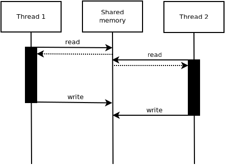
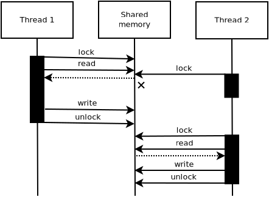
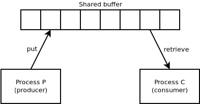
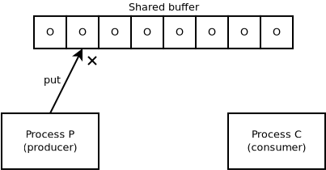
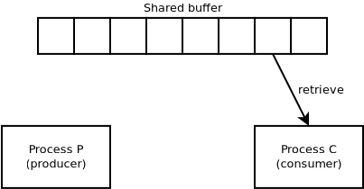
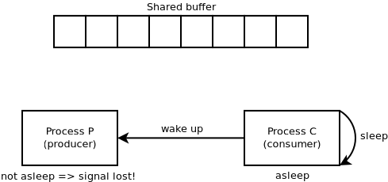
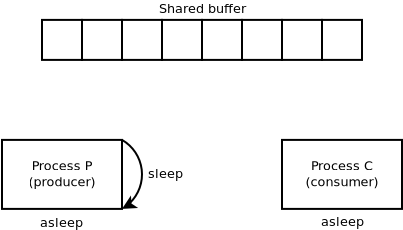
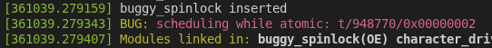
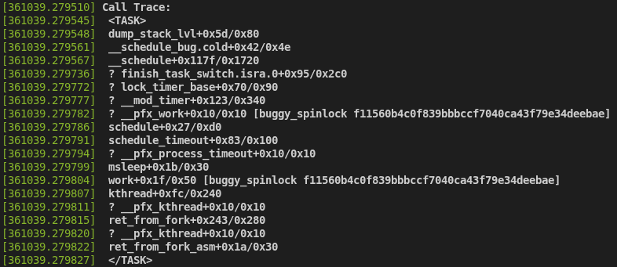
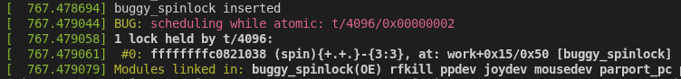

Title: On Linux kernel synchronization
Date: 2026-06-16 04:00
Category: Linux


From my practical work in kernel development so far, I realized that synchronization concerns are present in pretty much every single corner of kernel code. Hence, kernel synchronization is a topic that deserves special attention from kernel newbies like myself who want to build a working understanding of the Linux kernel and its inner workings. That realization led me to delve into kernel synchronization fundamentals in the last couple of weeks.

In this blog post, I summarize what I've learned about this subject so far, partly from Kaiwan N. Billimoria's _Linux Kernel Programming_ book, partly from revisiting Andrew S. Tanenbaum's _Operating Systems--Design and Implementation_ textbook (2 ed.), partly from reading kernel docs and other materials about the subject, and in large measure--and most importantly--from navigating the Linux kernel's codebase and programming C proofs of concept to actually see textbook materials and documentation claims come into life. First, we'll revisit some basic concepts of operating systems, then we'll gradually build on top of them to achieve an initial comprehension of Linux kernel synchronization mechanisms.

### The trouble with multithreaded environments

Multithreading is greatly advantageous in terms of throughput, but it comes with the caveat that if threads are not correctly synchronized while working upon shared writeable data, this might result in a form of unpredictable outcome known as a data race (a.k.a. race condition).

I've crafted the figure below to help illustrate the issue:



In the figure above, two threads, namely thread 1 and thread 2, both read and write shared memory. Let's imagine that the shared memory contains a data structure that receives updates from both threads.

It is easy to imagine a troublesome scenario as follows: thread 1 reads the data structure from shared memory. Before it's done updating it, thread 2 does the same and reads the data structure from shared memory. Next, thread 1 finishes updating the data structure and writes it back to shared memory. Just after that happens, thread 2 does the same, which results in it blindly overwriting the update that thread 1 had just done, thus corrupting the data.

While I was studying Billimoria's text, I extrapolated the book's proposed exercises to program [a proof of concept](https://github.com/vasconcedu/billimoria-linux-kernel-programming/src/branch/master/ch12/data_race) in user space, demonstrating a race similar to the one described above.

### A formal definition of data race

As much as the anecdotal example above might serve the purpose of building some intuition, data races are such an important issue to be aware of that the Linux kernel documentation contains a very formal definition of when data races occur and what to look for in order to find them. 

Billimoria points to that part of the documentation in his text, and I quote--from [`tools/memory-model/Documentation/explanation.txt`](https://git.kernel.org/pub/scm/linux/kernel/git/torvalds/linux.git/tree/tools/memory-model/Documentation/explanation.txt#n2231):

> "A "data race" occurs when there are two memory accesses such that:
> 
> 1.	they access the same location,
> 2.	at least one of them is a store,
> 3.	at least one of them is plain,
> 4.	they occur on different CPUs (or in different threads on the same CPU), and
> 5.	they execute concurrently.
>
> In the literature, two accesses are said to "conflict" if they satisfy 1 and 2 above.  We'll go a little farther and say that two accesses are "race candidates" if they satisfy 1 - 4.  Thus, whether or not two race candidates actually do race in a given execution depends on whether they are concurrent."

It's important to realize that what the documentation refers to as a "plain" access is an ordinary access to memory performed without resorting to kernel macros aimed at guaranteeing atomicity.

The definition above is very unambiguous, and it implies that in order to address data races adequately, it is important to describe the concepts around them rather systematically. In the following sections, I attempt to do that by delving further into the concepts behind data race prevention mechanisms built into the Linux kernel. The first topic we'll look into is that of critical sections.

### Critical sections

Billimoria defines a critical section as a section of code that fulfills these two conditions:

- First, there is the possibility that the code will run in parallel; and
- Second, the code changes writeable data.

From that definition, the author goes on to conclude that a critical section must run exclusively, sometimes even atomically. Now, running exclusively means that critical sections must run in a serialized fashion, so that no two threads ever run the same critical section at the same time. Running atomically means that critical sections must be allowed to finish uninterrupted before preemption of the running thread occurs. As we'll see, this is sometimes required, but not always.

In turn, Tanenbaum defines critical sections as the portions of a program that access shared memory. According to the author, no two processes must ever enter critical sections at the same time to prevent race conditions.

Both authors converge in saying that critical sections occur when concurrent code accesses shared data, and that in order to prevent them from causing trouble, we must come up with a way of guaranteeing exclusive execution. That leads us to discussing the topic of locks.

### Locks

A lock is an entity that can be "owned" by running threads, with a guarantee that at any given point in time, only one single thread can own it.

Thus, a lock can be leveraged to protect a critical section by binding access to the critical section to lock ownership. Since a lock can be owned by only one single thread at any given point in time, critical section serialization is guaranteed, because threads must wait for their turn to own the lock before they are allowed to enter the critical section.

After the thread that owns the lock finishes executing the critical section, it releases the lock--i.e. it "unlocks" the critical section. Only then, the other threads--that have been waiting--, get a chance to acquire ownership of the lock. The next thread that succeeds at acquiring ownership of the lock is then allowed to enter the critical section, while all the others remain waiting. This process repeats until all threads have a chance to acquire ownership of the lock and enter the critical section.

To illustrate, let's get back to the previous anecdotal example and see how a conceptual lock could be used to address the data race that emerged from those two threads accessing shared memory concurrently.

Here's an updated version of the previous figure to account for lock usage:



In the figure above, thread 1 acquires ownership of the lock, then enters the critical section and proceeds with updating the data structure in shared memory. While thread 1 is at it, thread 2 tries to acquire ownership of the lock to enter the critical section, which is blocked, because thread 1 already owns the lock. Thread 2 must wait until thread 1 releases the lock before it gets a chance to acquire it and enter the critical section. After thread 1 finishes the critical section, it releases the lock--"unlock"--, and thread 2 succeeds at acquiring it. Thread 2 is now allowed to enter the critical section and update the data structure in shared memory. After it's done, it also releases the lock, "unlocking" the critical section.

We'll now begin to look at some actual realizations of locks built into the Linux kernel.

Historically, many approaches have been proposed to locking critical sections and solving the problem of data races. Tanenbaum's textbook is very thorough about them. While I strongly recommend anyone who's serious about learning systems programming to read through that portion of his text, in this blog post, I'll be a bit more pragmatic and focus specifically on the excerpts that build the theoretical foundations to the core synchronization mechanisms found in the kernel's modern API, while leveraging the practicality of Billimoria's text to further develop such ideas and contextualize them in terms of contemporary kernel development.

That said, bear with me for a brief exploration of a fundamental synchronization primitive--the semaphore. We'll build upon semaphores to discuss the first type of lock widely used in modern kernel development later on--the mutex.

### The semaphore

Semaphores constitute a synchronization primitive [invented in the 60s by Edsger Dijktra](https://en.wikipedia.org/wiki/Semaphore_(programming)). In order to understand how semaphores work, let's look at a synchronization problem they help solve: [the producer-consumer problem](https://en.wikipedia.org/wiki/Producer%E2%80%93consumer_problem).

Imagine that two processes share a buffer. Process P, the producer, puts data into said buffer, while process C, the consumer, retrieves data from it. Process C can only ever retrieve data from the buffer if it is not empty, while process P can only ever put data into the buffer if it is not full. The figure below helps in visualizing this arrangement:



When process P tries to put data into the buffer to find that it is full, it goes to sleep. When a slot becomes available, process P is awaken. The same happens to process C when it tries to retrieve data from the buffer to find that it is empty. It goes to sleep, to be awaken when data becomes available. Each process checks whether the other is asleep and sends wake up signals accordingly.

Such setting is inherently racy. To illustrate, suppose that process P tries to put data into the buffer. It checks to see if the buffer is full, to find that it is, as illustrated in the figure below:



That results in process P going to sleep, but the scheduler says "Not so fast!": before process P has a chance to go to sleep, it is preempted, while process C is scheduled. Process C checks to see if there's data available for retrieval, to find that there is. So, it retrieves data from the buffer, and it so happens that the scheduler gives it enough processor time to empty the entire buffer:



Next, process C checks to see if process P should be sleeping, to find that it shouldn't--because there's now plenty of empty slots in the buffer--, resulting in it signaling process P to wake up. Then, it goes to sleep, because the buffer is empty. The trouble is since process P is not actually asleep, process C's wake up signal is lost:



Next, process P is scheduled. It resumes execution by going to sleep. At this point, both processes are asleep, and they will remain in that state indefinitely:



Semaphores introduce the idea of saving wake up signals for future use. This is done using an integer whose value is initialized to `0`, but that can be incremented or decremented using the atomic operations `up()` and `down()`, respectively. `down()` checks if the value of the semaphore is greater than `0`. If so, it decrements its value. If not, the process goes to sleep. In turn, `up()` increments the value of the semaphore. In case any processes were asleep on said semaphore, the system wakes one of them up and allows it to complete its `down()` operation, immediately decrementing the value of the semaphore, but resulting in having one less process asleep on it.

Concrete semaphore implementations must guarantee that the operations described above are atomic, and that no two processes ever access the semaphore at the same time. If such premises hold, it is possible to use 3 semaphores to solve the producer-consumer problem. Tanenbaum names them as follows:

- Semaphore "full" keeps track of the number of slots in the buffer that are occupied;
- Semaphore "empty" keeps track of the number of slots in the buffer that are free; and
- Semaphore "mutual exclusion"--a.k.a. "mutex"--guarantees that processes P and C do not ever access the buffer at the same time. Semaphores of this kind are also referred to as "binary semaphores".

Initially, full's value is `0`, and empty's value is equal to the total number of slots in the buffer. Mutex's value is 1, representing that no process is accessing the buffer. Whenever a process is about to access the buffer--hence entering the critical section--, it must first `down()` mutex.

Let's examine how full works. Whenever the consumer is about to retrieve data from the buffer, it calls `down()` on full. If the value of full is `0`--meaning the buffer is empty--, this results in the consumer going to sleep on full, preventing it from proceeding while the buffer is empty. Whenever the producer calls `up()` on full--which happens when the producer exits the critical section, after putting data into the buffer--, the system wakes the consumer up and allows it to complete its `down()` operation. On the other hand, if the value of full is greater than `0`, this results in the consumer being allowed to enter the critical section, accessing the buffer--which in turn is protected by mutex, as described below.

Conversely, empty works as follows: whenever the producer is about to put data into the buffer, it calls `down()` on empty. If the value of empty is `0`, meaning there are no empty slots--i.e. the buffer is full--, this results in the producer going to sleep on empty, preventing it from proceeding while the buffer is full. Whenever the consumer calls `up()` on empty--which happens when the consumer exits the critical section, after retrieving data from the buffer--, the system wakes the producer up and allows it to complete its `down()` operation. On the other hand, if the value of empty is greater than `0`, this results in the producer being allowed to enter the critical section, accessing the buffer--which in turn is protected by mutex, as described below.

Now, let's examine what happens when either process is about to enter the critical section and the other process is not inside of it. It's quite simple: the process calls `down()` on mutex, whose value becomes `0`, effectively locking the critical section and allowing the process to access the buffer safely. Before it exits the critical section, it must call `up()` on mutex, restoring its value to `1`, thus unlocking the critical section. Now, what happens when a process wants to enter the critical section, but the other process is inside of it? It calls `down()` on mutex. `down()` verifies that the value of mutex is already `0`, which makes the process sleep on mutex. This results in mutex preventing concurrent accesses to the buffer, thus serializing critical section access.

The paragraphs above might be rather convoluted, and perhaps the best way to understand the solution they describe is to revisit them a couple of times while looking at the implementation's pseudocode with pen and paper at hand. The pseudocode below, adapted from Tanenbaum's text, presents the solution described above. If you're interested, I've also written [a user space C program implementing Tanenbaum's solution for the producer-consumer problem](https://github.com/vasconcedu/billimoria-linux-kernel-programming/src/branch/master/ch12/producer_consumer/producer_consumer.c).

```c
semaphore mutex = 1;
semaphore empty = N; // N is the number of slots in the buffer
semaphore full = 0;

void producer()
{
    while(1) {
        down(&empty);
        down(&mutex);
        put_data(/* Data */);
        up(&mutex);
        up(&full);
    }
}

void consumer()
{
    while(1) {
        down(&full);
        down(&mutex);
        retrieve_data(&/* Data */);
        up(&mutex);
        up(&empty);
    }
}
```

Now that we've established an intuition about semaphores, we can finally look at some of the kernel's concrete lock implementations. The first type of lock that we'll delve into is the mutex, and it surely helps that we've just visited Tanenbaum's theoretical development on its inner workings by looking at the producer-consumer problem.

### The mutex

[In his text _Generic Mutex Subsystem_ in the kernel docs](https://docs.kernel.org/locking/mutex-design.html), kernel maintainer Ingo Molnar defines mutexes as follows:

> "In the Linux kernel, mutexes refer to a particular locking primitive that enforces serialization on shared memory systems, and not only to the generic term referring to "mutual exclusion" found in academia or similar theoretical text books. Mutexes are sleeping locks which behave similarly to binary semaphores, and were introduced in 2006 as an alternative to these."

If you're interested, I've programmed [a proof of concept kernel module to demonstrate mutex utilization, including a forced race condition](https://github.com/vasconcedu/billimoria-linux-kernel-programming/src/branch/master/ch12/mutex/mutex.c), but it's easy to summarize basic mutex usage in pseudocode as follows:

```c
/* ... */

#include <linux/mutex.h> // Defines the mutex kernel API

/* ... */

DEFINE_MUTEX(/* Mutex name */); // DEFINE_MUTEX() defines and initializes an instance of mutex

/* ... */

mutex_lock(&/* Mutex name */); // Locks the critical section

/* Critical section */

mutex_unlock(&/* Mutex name */); // Unlocks the critical section

/* ... */
```

As much as things might look rather straightforward, here's what kernel development has really taught me so far: if you understand something, you haven't looked hard enough yet--look again. The truth is all sorts of caveats apply here. Here's a few that I've been able to map so far.

First, let us remember that after a thread succeeds at acquiring ownership of a mutex, further attempts to acquire it will block, which theoretically--as we've seen from studying Tanenbaum's text--should result in the blocked thread being put to sleep. The Linux kernel's implementation of mutex differs a bit from textbook material, though. Blocking [results in the _possibility_--called the "slow path"--that blocked threads are put to sleep](https://git.kernel.org/pub/scm/linux/kernel/git/torvalds/linux.git/tree/kernel/locking/mutex.c#n293) until the thread that owns the mutex exits the critical section and unlocks it, when the mutex becomes available again. This is the reason why Ingo Molnar refers to mutexes as "sleeping locks" in his text. But mind the word _possibility_ here.

One alternative to the slow path, [that happens when there are no threads whose priority is higher than that of the candidate thread ready to acquire the lock and enter the critical section](https://docs.kernel.org/locking/mutex-design.html#implementation), is the "mid path". This path to lock acquisition is based on the heuristic that the owner thread should release the lock soon, which justifies avoiding the slow path that would result in putting the candidate thread to sleep. When the mid path happens, the candidate thread enters a state in which it is said to "spin for lock acquisition"--what this entails will become clearer soon, when we delve into the topic of spinlocks. The performance gain that the mid path introduces in mutex implementation is very clear. As Ingo Molnar puts it in the aforementioned kernel docs text:

> "By simply not interrupting a task and busy-waiting for a few cycles instead of immediately sleeping, the performance of this lock has been seen to significantly improve a number of workloads."

With all that said, it's easy to understand why Billimoria's text is emphatic about the fact that mutexes should only ever be used in scenarios where sleeping while waiting for lock release is possible. A consequence of that behavior is that mutexes introduce the potential need to fully switch the context of blocked threads off the processor and switch them back onto the processor after the mutex unlocks, which is inherently expensive.

[Mutexes also fall short in efficiency with regards to their size](https://docs.kernel.org/locking/mutex-design.html#disadvantages), as they are among some of the largest locks in the kernel API, leading to more significant caching and memory footprints if compared to other locking mechanisms.

Despite their drawbacks, mutexes are still the default locking primitive for good reason. [Ingo Molnar's guidance is clear](https://docs.kernel.org/locking/mutex-design.html#when-to-use-mutexes):

> "Unless the strict semantics of mutexes are unsuitable and/or the critical region prevents the lock from being shared, always prefer them to any other locking primitive."

Which means kernel newbies like myself can rest assured that mutexes are likely the locking mechanism of choice, unless the specific situation simply has special requirements that mutexes can't handle--e.g. because serialization is not necessary and would actually hurt performance, or because the critical section wouldn't allow multiple accesses anyway.

Having explored the mutex lock, let's now look at the next concrete implementation of lock in the Linux kernel API: the spinlock.

### The spinlock

The spinlock is based on the concept of "spinning", which means having a thread "spin" for lock acquisition until it succeeds. In other words, using the spinlock means we'll have a thread perform busy waiting for the lock, [essentially polling for it](https://documentation.ubuntu.com/real-time/latest/explanation/locks/#spinlocks). Hence, differently from the mutex, [the thread never sleeps, which makes the spinlock usable in contexts where sleeping is not an option](https://kernel-internals.org/locking/spinlock/).

Before we continue, in order to illustrate this concept, let's take a look at another theoretical excerpt of Tanenbaum's text where he defines [an instruction called "Test and Set Lock", or TSL](https://en.wikipedia.org/wiki/Test-and-set). TSL is an atomic instruction that reads the value of a shared variable, then sets its value to `1`, while storing its previous value in a register. Since TSL is atomic, it can be leveraged to implement spinning for lock acquisition. Suppose that we have a variable--e.g. `lock`--which is used to protect the critical section of a program. When `lock == 0`, any thread can spin for lock acquisition and evetually succeed at acquiring it. When `lock == 1`, it means there's a thread actively accessing the critical section, and no other thread should be allowed to enter it. When a thread exits the critical section, it's expected to actively set the value of `lock` back to `0`. The assembly pseudocode snippet below shows Tanenbaum's theoretical implementation of a spinlock leveraging the TSL instruction:

```asm
enter_crit_sec:
    tsl reg, lock ; Reads the value of lock to register, while setting the value of lock to 1
    cmp reg, #0 ; Checks to see if register == 0--i.e. if the previous value of lock was 0
    jne enter_crit_sec ; If the previous comparison failed--i.e. register != 0 => spin
    ret

leave_crit_sec:
    move lock, #0 ; Set the value of lock back to 0
    ret
```

The code snippet above makes it easy to see why it is said that busy waiting wastes processor time: whenever `cmp reg, #0` fails, the code jumps back to `enter_crit_sec`, leading to the lock acquisition logic executing all over again, until it succeeds and the thread is allowed to enter the critical section. In fact, due to this very drawback, [spinlocks should only ever be used in very short critical sections of the order of microseconds](https://kernel-internals.org/locking/spinlock/).

Having understood the fundamental concepts behind spinlocks, we can now get back to the kernel's implementation. We can summarize basic spinlock usage in pseudocode as follows:

```c
/* ... */

#include <linux/spinlock.h> // Defines the spinlock kernel API

/* ... */

DEFINE_SPINLOCK(/* Spinlock name */); // DEFINE_SPINLOCK() defines and initializes an instance of spinlock

/* ... */

spin_lock(&/* Spinlock name */); // Locks the critical section--spinning for lock acquisition

/* Critical section */

spin_unlock(&/* Spinlock name */); // Unlocks the critical section

/* ... */
```

Instead of looking at a proof of concept implementation of spinlock usage, let's look at an excerpt of the AppArmor LSM that actively uses the spinlock API. That will allow us to unveil a very interesting aspect of the API while studying a real use case. Before delving into the analysis, one should know that AppArmor applies a caching strategy comprising of local per-CPU caches and a global cache shared across all CPUs. That strategy allows AppArmor to increase performance by minimizing taking code paths that would result in busy waiting for access to the global cache.

As much as a detailed look at the internals of such mechanism is out of the scope of this blog post, [function `aa_get_buffer()`](https://git.kernel.org/pub/scm/linux/kernel/git/torvalds/linux.git/tree/security/apparmor/lsm.c#n2136), defined in AppArmor's `lsm.c`, provides a rather interesting perspective to the spinlock API. Particularly, it illustrates the combined usage of `spin_lock()` and `spin_trylock()`.

The `spin_trylock()` API [tries to acquire a given lock, returning non-zero if it succeeds, and `0` otherwise](https://www.kernel.org/doc/html/latest/kernel-hacking/locking.html#the-trylock-functions). As we've seen, the `spin_lock()` API makes the thread spin for lock acquisition, effectively making it enter a state of busy waiting, thus wasting processor time. Because the `spin_trylock()` API does not necessarily result in entering busy waiting on failure, it allows the thread to do something else in case acquiring the lock fails.

The relevant portions of the `aa_get_buffer()` function are shown below, with my analysis included as inline comments:

```c
char *aa_get_buffer(/* ... */)
{
	/* ... */

    /* 
     * **OMITTED**: first, the function tries the fast path 
     * without any locking, which would result in returning
     * a buffer from the local cache. This is always safe
     * because each CPU has its own instance of local cache.
     */

    /* ... */

    /*
     * If the above fails...
     */

    /*
     * Try to acquire the global cache lock:
     */
	if (!spin_trylock(&aa_buffers_lock)) {

        /* If the above fails, handle cache contention... */

        /* ... */

        /* ... then fallback to spinning for lock acquisition: */
		spin_lock(&aa_buffers_lock);
	}
retry:
    /*
     * At this point, it is important to realize that the lock has
     * necessarily been acquired, either by spin_trylock() or by
     * spin_lock() above. Next, check if a buffer can be taken from the
     * global cache. Supposing that the function has been called from
     * a non-atomic context (which would introduce further complexity),
     * this should only be allowed if the number of buffers cached
     * globally (buffer_count) is greater than the number of buffers
     * that should always be cached globally (reserve_count).
     */
	if (buffer_count > reserve_count || /* ... */ ) {

        /*
         * If the condition above holds, take a buffer from the
         * global cache, perform additional caching logic and...
         */

         /* ... */

        /* ... unlock the global cache... */
		spin_unlock(&aa_buffers_lock);
		return aa_buf->buffer; // ... before returning said buffer.
	}
	
    /* **OMITTED**: atomic context logic.  */

    /* ... */

    /* 
     * If buffer_count <= reserve_count, then this means that 
     * no buffer has been returned yet. First, release the lock:
     */
	spin_unlock(&aa_buffers_lock);

	/* **OMITTED**: atomic context logic.  */

    /* ... */

    /*
     * Since no locks are being held, it is now safe to allocate
     * memory for a new buffer:
     */
	aa_buf = kmalloc(aa_g_path_max, /* ... */);
	if (!aa_buf) { // If the allocation fails...
		if (try_again) {
			try_again = false;
			spin_lock(&aa_buffers_lock); // ... spin for the lock again...
            /*
             * ... and try once more. This seems to handle a race condition
             * between the time buffer availability has been checked--i.e.
             * buffer_count > reserve_count and buffer allocation:
             */
			goto retry;
		}
		pr_warn_once("AppArmor: Failed to allocate a memory buffer.\n");
		return NULL;
	}
	return aa_buf->buffer;
}
```

Hopefully, the case study above provided some insight into the nuances involved in using the spinlock API, and served the purpose of shedding light on the fact that as much as basic usage is rather straightforward, just as for the mutex API, there's a lot more to the spinlock API.

In that sense, it seems relevant to further stress the important caveat--which the snippet above makes very clear--that [spinlocks should not be held across sleeping calls such as `kmalloc()`](https://kernel-internals.org/locking/spinlock/). In fact, trying to sleep while holding a spinlock results in an error. Billimoria shows an instance of this bug in his text, but I wanted to cause this error myself to actually see what happened in my development box, and I ended up programming yet [another proof of concept in C to simulate the situation where a buggy module tries to hold a spinlock across a sleeping call](https://github.com/vasconcedu/billimoria-linux-kernel-programming/src/branch/master/ch12/buggy_spinlock/buggy_spinlock.c). Here's the error message that showed up in `dmesg` after running it:



The error log says that the module tried "scheduling while atomic". If we follow the call trace that led to the error, we'll be able to make a bit more of sense out of it:



We see that our `work()` function called `msleep()`--[`ssleep()` is a wrapper to `msleep()`](https://git.kernel.org/pub/scm/linux/kernel/git/torvalds/linux.git/tree/include/linux/delay.h#n101), so the beginning of the call trace makes sense. In turn, `msleep()` calls `schedule_timeout()`, which finally calls `schedule()`, leading to the error. Ultimately, the trouble seems to be that the call sequence after `ssleep()` ends up resorting to the scheduler subsystem to make the thread sleep until the specified time has elapsed, which is simply not allowed due to the fact that the spinlock is held. In fact, that claim finds support in the explanation that kernel maintainer Jonathan Corbet gave about that matter in [his article _Atomic context and kernel API design_ in LWN.net](https://lwn.net/Articles/274695/):

>  "Kernel code generally runs in one of two fundamental contexts. Process context reigns when the kernel is running directly on behalf of a (usually) user-space process; the code which implements system calls is one example. When the kernel is running in process context, it is allowed to go to sleep if necessary. But when the kernel is running in atomic context, things like sleeping are not allowed. Code which handles hardware and software interrupts is one obvious example of atomic context.
>
> There is more to it than that, though: any kernel function moves into atomic context the moment it acquires a spinlock. Given the way spinlocks are implemented, going to sleep while holding one would be a fatal error; if some other kernel function tried to acquire the same lock, the system would almost certainly deadlock forever."

That explains why the kernel treated and logged the excerpt as a bug. While the consequences in lab environment were mild, in real life, sleeping while a spinlock is held could lead to really drastic outcomes.

At this point, we have already built an initial working understanding of the most prominent kernel synchronization mechanisms, namely mutexes and spinlocks. Before wrapping up the discussion herein, let's turn our attention to what's perhaps the most insidious synchronization bug: the deadlock.

### A few words on deadlocks

In this section, we'll try to reach an understanding of what deadlocks are by looking at Tanenbaum's text on the subject. Then, we'll try to understand how to prevent them in practice by looking at several kernel documentation resources that address the issue of deadlocks.

Tanenbaum defines a deadlock as a situation involving a set of processes where each process in the set is waiting for an event that can only be triggered by another process in the set. The figure below illustrates the issue: 


In the figure, process 1 is waiting for process 2 to trigger some event. In turn, process 2 is also waiting for process 1 to trigger some event. This leads to a situation where both processes are unable to proceed due to depending on the other, configuring a deadlock. As much as the figure illustrates a situation consisting of a deadlock between two processes, more complex scenarios called "deadly embraces" comprising of multiple processes and/or locks might emerge--[as explained by kernel hacker and ex-maintainer Rusty Russell in his _Unreliable Guide To Locking_](https://www.kernel.org/pub/linux/kernel/people/rusty/kernel-locking/c412.html).

Tanenbaum's text also presents [Coffman's conditions, which resulted from the work of Edward Coffman published in 1971](https://en.wikipedia.org/wiki/Deadlock_(computer_science)). These four conditions must all be simultaneously satisfied for a deadlock to occur:

1. Mutual exclusion--i.e. each resource can only be held by one process at a time;
2. Resource holding--i.e. each process is holding at least one resource and requesting to hold resources that are being held by other proceses;
3. No preemption--i.e. each process must voluntarily release the resource that it is holding; and
4. Circular wait--i.e. there must be a circular chain of processes waiting for resources that are being held by the next processes in the chain.

If all of Coffman's conditions are satisfied simultaneously, then there's a deadlock. If at least one of Coffman's conditions is not satisfied, then there's no deadlock.

Coffman's work was fundamental in developing deadlock prevention and recovery algorithms, and Tanenbaum's text is very thorough about the subject. In this blog post, though, I'll try to be a bit more pragmatic and explore the concrete guidelines that apply to deadlock prevention in the specific context of Linux kernel development. Nevertheless, Coffman's conditions provide rather useful guidance--especially to kernel newbies like myself--on what to aim for while developing and what to look for while debugging potential deadlocks.

That said, some general guidelines apply to deadlock prevention in the Linux kernel. First, lock ordering is very important, meaning locks should always be acquired in the same order across all threads. But why is that? [This article provides a rather convincing counterexample](https://litux.nl/mirror/kerneldevelopment/0672327201/ch08lev1sec3.html), which I reproduce--adapted--here: suppose two threads, thread 1 and thread 2, must acquire locks eeny, meeny, miny, and moe. Thread 1 acquires locks eeny, meeny, and miny, then tries to acquire lock moe, but it blocks, because thread 2 had already acquired it. In the meantime, thread 2 acquires lock moe, then tries to acquire lock eeny, but it blocks, because thread 1 had already acquired it. Now, thread 1 is waiting for thread 2 to release lock moe, and thread 2 is waiting for thread 1 to release lock eeny: a deadlock. More specifically, a deadly embrace. If both threads tried to acquire the locks in the same order, this situation wouldn't have happened.

As much as the recommendation above seems to appear frequently in kernel deadlock prevention materials, Rusty Russell has a more pragmatic view on lock ordering, and I quote, from [section 7.2. Preventing Deadlock in _Unreliable Guide To Locking_](https://www.kernel.org/pub/linux/kernel/people/rusty/kernel-locking/c412.html)

> "Textbooks will tell you that if you always lock in the same order, you will never get this kind of deadlock. Practice will tell you that this approach doesn't scale: when I create a new lock, I don't understand enough of the kernel to figure out where in the 5000 lock hierarchy it will fit."

That said, he goes on to provide a rule of thumb to guide lock development:

> "The best locks are encapsulated: they never get exposed in headers, and are never held around calls to non-trivial functions outside the same file. You can read through this code and see that it will never deadlock, because it never tries to grab another lock while it has that one. People using your code don't even need to know you are using a lock."

That is also the view kernel maintainer Jonathan Corbet expressed [in his article _The kernel lock validator_ in LWN.net](https://lwn.net/Articles/185666/):

> "[...] kernel developers try to define rules for the order in which locks should be acquired. But, in a system with many thousands of locks, defining a comprehensive set of rules is challenging at best, and enforcing them is even harder."

Thus, one should aim at simplicity with regards to locking. Locking mechanisms are already complex in themselves, and the simpler one is able to keep lock design, the better.

Several other aspects to be aware of in lock design include paying attention to the possibility of starvation--i.e. having a process wait indefinitely for a lock simply because the process holding it never releases it--, and trying to acquire the same lock a second time while still holding it, thus leading to [a type of deadlock called "self-deadlock"](https://docs.oracle.com/cd/E19455-01/806-5257/6je9h0347/index.html).

Finally, one should be aware of [the Lockdep subsystem](https://kernel-internals.org/locking/lockdep/). Lockdep is a subsystem that is targetet at performing lock validation. It is enabled by configuration option `CONFIG_PROVE_LOCKING`, and it works by tracking lock classes in runtime, keeping a lock dependency graph in memory that is updated every time a lock is acquired. Whenever a buggy lock dependency is observed, Lockdep issues a warning message. I compiled a kernel for my development box with `CONFIG_PROVE_LOCKING=y`--while keeping default values to other Lockdep configuration options--to see what actual Lockdep messages look like, and after reinstalling the kernel and rerunning [my buggy spinlock proof of concept against it](https://github.com/vasconcedu/billimoria-linux-kernel-programming/src/branch/master/ch12/buggy_spinlock/buggy_spinlock.c), apart from the subsystem's data interface at `/proc/lockdep*`, I saw new log lines in `dmesg`, demonstrating that the subsystem was up and actively monitoring acquired locks in runtime:



The trouble with Lockdep is that [it introduces non-negligible performance overheads](https://kernel-internals.org/locking/lockdep/), thus it should only be used for development/testing purposes, while remaining deactivated in production kernels. Nevertheless, it is surely an interesting tool to be aware of as it provides powerful practical validation to the rather complex exercise of developing adequate kernel locking.

### Conclusion and where to go from here

In this blog post, we explored the issues associated with multithreading, defining data races and critical sections, then we moved on to establishing an intuition about the theoretical aspects of locks, and discussed the most prominent locks in the Linux kernel, namely mutexes and spinlocks. We looked at their use cases and drawbacks. Finally, we briefly discussed the topic of deadlocks.

To conclude, despite its length, I must stress that this blog post only provided an introductory discussion to the topic of kernel synchronization. There is much more to discuss regarding this topic, but for now, I'm satisfied. I feel that the last couple of weeks of delving into kernel synchronization have armed me with much stronger tools to perform kernel work involving locking primitives.

The next steps in my systems programming journey will probably be getting back to my LSM studies--I've got a very decent continuation idea in mind for part II of [my blog post on LSM internals--](https://vasconcedu.github.io/study-notes-on-the-linux-security-module-lsm-kernel-framework-part-1.html), and looking at the memory management subsystem. While I'm at it, I'll also probaly consolidate a project idea in which I've been working for my PhD, and certainly look for further opportunities to contribute to upstream, which I haven't done in a while to concentrate on studying synchronization.

_Happy hacking._