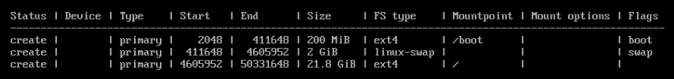
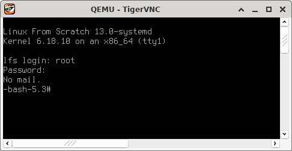
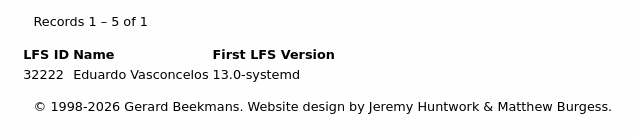

Title: Compilando Linux From Scratch (LFS)
Date: 2026-04-05 00:00
Category: Linux


> "Playfully doing something difficult, whether useful or not, that is hacking."
>
> -- Richard Stallman, _On Hacking_

Ao longo das últimas semanas, em detrimento dos devidos sono e asseio, trabalhei, pela primeira vez, na compilação do meu próprio sistema Linux. Usei como guia o livro _Linux From Scratch: Version 13.0-systemd_, publicado pelo projeto homônimo, [Linux From Scratch](https://linuxfromscratch.org/index.html). Os processos de compilação e configuração básica já estão finalizados. Obtive um sistema LFS plenamente funcional, em dual boot com o host virtual Arch que utilizei para compilá-lo.

Eu uso--e amo--Linux há cerca de 15 anos. Comecei pelo Ubuntu 8.04 LTS "Hardy Heron", em meados de 2010. Desde então, não parei mais: já tive a minha parcela de distro hopping; converti algumas pessoas e ajudei outras tantas a instalarem ou configurarem Linux; instalei e administrei servidores Linux críticos no meu primeiro emprego formal, como sysadmin; venho usando Linux como ferramenta de trabalho há anos, como engenheiro de segurança; e a minha computação pessoal, como não poderia deixar de ser, é completamente baseada em Linux. Atualmente, o meu amado daily driver é um ThinkPad T480--usado--com Arch, _btw_. No entanto, até hoje, uma das peças faltantes na minha trajetória era compilar o meu próprio sistema Linux. Esse já era um sonho de longa data. Há pouco, ele foi realizado.

Em um primeiro momento, esse exercício pode até parecer algo muito difícil de ser cumprido, mas a verdade é que compilar LFS é muito mais simples do que parece, dada a devida assiduidade no uso de Linux, e o grande "plot twist" é que esse processo serviu para revelar muita, mas muita coisa sobre Linux que eu simplesmente não sei. Vejo que compilar o meu próprio sistema pela primeira vez foi apenas o início da fase de desconstrução em um processo de aprendizado¹ que, estou certo, ainda vai durar muito tempo.

Sem mais delongas, a seguir, relato humildemente como foi a minha experiência de compilar Linux From Scratch.

## Para quem é o Linux From Scratch?

Eu não diria que seria impossível que uma pessoa que tivesse apenas iniciado a sua trajetória com Linux conseguisse compilar o seu próprio sistema Linux com base no Linux From Scratch, mas esse processo seria extremamente demorado, trabalhoso e frustrante, demandaria uma força de vontade e uma paciência muito grandes, e seria possível que o tempo investido nisso fosse mais bem aproveitado se essa pessoa se dedicasse a aprender assuntos mais básicos, adquirindo pelo menos alguns anos de experiência com Linux como daily driver antes de atacar esse projeto.

Não se engane: apesar de o livro ser muito detalhado, ele assume certos conhecimentos a priori, de forma que compilar Linux From Scratch demanda bastante afinidade com o terminal e conhecimento prático sobre particionamento, sistemas de arquivos, permissões e builds a partir de código-fonte, dentre outros assuntos.

O livro deixa muita coisa a cargo do leitor, e eu diria que conhecimento prático de Linux--que me parece que só pode ser adquirido ao longo de um tempo razoável de daily driving--é fundamental para o sucesso de certos procedimentos de compilação e até mesmo de setup. Ter afinidade com virtualização de sistemas Linux, por exemplo, me parece algo particularmente interessante, por simplificar--muito--o setup do host de compilação. Sem falar que colocar o sistema de pé depois da compilação é praticamente por sua conta: o livro fala muito pouco sobre configurações de boot, até porque estas dependem muito do host que você tiver escolhido, do uso ou não de dual boot e/ou das características da máquina em que você for colocar o LFS de pé.

## Instalação do host

Eu optei por utilizar uma máquina virtual Arch como host de compilação, usando o QEMU em uma máquina Arch física como virtualizador. O primeiro passo foi criar um disco virtual para o host. Usei o `qemu-img` para isso:

```bash
qemu-img create -f qcow2 arch.qcow2 24G
```

24 GB me pareceram razoáveis diante da [documentação suplementar do LFS sobre particionamento](https://www.linuxfromscratch.org/hints/downloads/files/partitioning-for-lfs.txt). Em seguida, iniciei a VM com:

```bash
qemu-system-x86_64 -cdrom archlinux-2026.03.01-x86_64.iso -boot order=d -drive file=arch.qcow2,format=qcow2 -m 8G
```

Não cabe cobrir todo o processo de instalação do Arch aqui, mas eu particionei o disco virtual da seguinte forma:



Quanto ao tipo de instalação do Arch, optei por `Minimal`. Também incluí os pacotes `openssh` e `vim`. De uma próxima vez que for compilar LFS, também vou incluir `wget` e, possivelmente, trocar o Vim pelo Nano, por uma questão de manter a simplicidade. Como constatei depois, as necessidades de edição para compilar LFS são bastante básicas. Além disso, criei um usuário e fiz dele sudoer. Teria sido interessante, ainda, já instalar os pacotes das dependências de compilação do LFS para o host durante a instalação do Arch. Como não fiz isso, precisei instalá-las mais adiante.

Finalizada a instalação, deliguei e reiniciei a VM com:

```
qemu-system-x86_64 -boot order=d -drive file=arch.qcow2,format=qcow2 -m 8G
```

Seria interessante já ter utilizado `-smp 4` aqui para iniciar o host com 4 processadores. Eu acabei não fazendo isso e precisando desligar a VM para reiniciá-la com essa configuração mais adiante, no meio do processo, o que resultou em ter de refazer parte do setup de compilação no host, conforme a seção 2.3 e o final do capítulo 7 do livro discutem.

## Configuração do SSH

Após acessar a VM via VNC, segui com a configuração de SSH para que eu pudesse ter um terminal mais bem servido de features para trabalhar durante a compilação. Eu diria que esse passo é quase imprescindível ao optar por compilar LFS em ambiente virtualizado. Poder colar comandos copiados da versão HTML do livro em uma sessão de SSH entre a sua máquina física e o host de compilação me parece ser a maneira mais segura de seguir os passos do livro, por evitar problemas relacionados a erros de digitação ao reproduzir comandos em um terminal em que você não consegue copiar e colar, além de possíveis inconsistências ao copiar comandos a partir da versão PDF do livro.

No Arch--com o `openssh` devidamente instalado--, configurar SSH consiste em editar `/etc/ssh/sshd_config`. É uma boa ideia fazer um backup desse arquivo antes. É preciso descomentar:

```bash
Port 22
AddressFamily any
ListenAddress 0.0.0.0
ListenAddress ::
```

Além de incluir:

```bash
AllowUsers <usuário>
```

Onde `<usuário>` é o usuário que você criou durante a instalação do Arch. Depois disso, reiniciei o `sshd` e verifiquei se estava tudo certo com:

```bash
sudo systemctl start sshd.service
sudo systemctl status sshd.service
```

Por fim, configurei o serviço para iniciar automaticamente com: 

```bash
sudo systemctl enable sshd.service
```

Feito isso, desliguei e voltei a iniciar o host de compilação, redirecionando a porta 60022 da minha máquina física para a porta 22 da VM:

```bash
qemu-system-x86_64 -boot order=d -drive file=arch.qcow2,format=qcow2 -m 8G -nic user,hostfwd=tcp::60022-:22
```

Com isso, pude conectar à VM usando SSH e trabalhar de maneira muito mais simples. A essa altura, fiz a instalação das dependências previstas na seção 2.2 do livro. Como já mencionei, de uma próxima fez, farei a instalação destas durante a instalação do Arch para poder pular esse passo.

## Partição de LFS

Criei um segundo disco virtual de 24 GB com o `qemu-img`. Em seguida, desliguei e voltei a iniciar a VM, dessa vez com os dois discos:

```bash
qemu-system-x86_64 -boot order=d -drive file=arch.qcow2,format=qcow2 -drive file=lfs.qcow2,format=qcow2 -m 8G -nic user,hostfwd=tcp::60022-:22
```

Pude confirmar que o segundo disco estava disponível com `lsblk`:

```bash
NAME   MAJ:MIN RM  SIZE RO TYPE MOUNTPOINTS
fd0      2:0    1    4K  0 disk 
sda      8:0    0   24G  0 disk 
├─sda1   8:1    0  200M  0 part /boot
├─sda2   8:2    0    2G  0 part 
└─sda3   8:3    0 21.8G  0 part /
sdb      8:16   0   24G  0 disk 
sr0     11:0    1 1024M  0 rom  
zram0  253:0    0    4G  0 disk [SWAP]
```

O próximo passo foi formatá-lo:

```bash
sudo mkfs -v -t ext4 /dev/sdb
```

Em seguida, pude seguir com a definição de `$LFS`, a partir da seção 2.6, e seguir as instruções de compilação e configuração, até o começo do capítulo 10. Essa foi a parte mais difícil do processo, em grande medida por ser muito repetitiva, e levei algo como duas semanas para concluí-la.

É preciso levar em consideração que eu havia iniciado o host com um processador só. A certa altura, eu o reiniciei com 4 processadores para melhorar em alguns pontos percentuais a minha qualidade de vida. Esse tempo poderia ter sido menor se eu o tivesse iniciado com 4 processadores desde o começo. Além disso, eu não me dediquei em tempo integral, mas apenas no tempo livre, especialmente à noite e nos finais de semana. Independente disso, como eu executei todos os testes, a compilação de alguns pacotes, como o GCC, foi particularmente demorada.

.

.

.

.

.

.

.

.

.

## /etc/fstab

Finalizada a compilação dos pacotes, segui aos últimos passos da instalação. A seção 10.2 discute a criação de `/etc/fstab`. Dadas as características do meu setup, o meu arquivo ficou assim:

```bash
bash-5.3# cat /mnt/lfs/etc/fstab 
# Begin /etc/fstab

# file system  mount-point  type     options             dump  fsck
#                                                              order

/dev/sda1     /boot        ext4	    defaults            0     2	
/dev/sdb      /            ext4     defaults            1     1
/dev/sda2     swap         swap     pri=1               0     0

# End /etc/fstab
```

## Compilação e instalação do kernel

A compilação do kernel foi mais simples e, sobretudo, mais rápida do que eu imaginava. Chequei os parâmetros de compilação duas vezes. O processo se deu sem intercorrências e durou menos de uma noite--iniciei a compilação por volta das 20h30 e, às 6h00 do outro dia, ela já havia finalizado. Como o meu plano era manter o LFS em dual boot com o host Arch, montei a partição de boot e copiei a imagem compilada do kernel para ela--no meu caso, a imagem x86\_64 `vmlinuz-6.18.10-lfs-13.0-systemd`:

```bash
bash-5.3# ls /boot/vmlinuz-6.18.10-lfs-13.0-systemd 
/boot/vmlinuz-6.18.10-lfs-13.0-systemd
```

## Configuração do GRUB

Finalmente, alterei as configurações do GRUB. Optei por adicionar a entrada de menu do GRUB do LFS no `grub.cfg` criado pelo próprio Arch, em uma seção destinada especificamente a personalizações:

```bash
### BEGIN /etc/grub.d/40_custom ###
# This file provides an easy way to add custom menu entries.  Simply type the
# menu entries you want to add after this comment.  Be careful not to change
# the 'exec tail' line above.

insmod part_msdos
insmod ext2
set root='hd0,msdos1'
set gfxpayload=1024x768x32
menuentry "GNU/Linux, Linux 6.18.10-lfs-13.0-systemd" {
	linux	/vmlinuz-6.18.10-lfs-13.0-systemd root=/dev/sdb ro
}
### END /etc/grub.d/40_custom ###
```

Note-se que o processo de atualização do GRUB conforme documentado [na Wiki do Arch](https://wiki.archlinux.org/title/GRUB)--i.e. usando `grub-mkconfig`, **mesmo com `GRUB_DISABLE_OS_PROBER=false`**--, não funciona aqui. É preciso atualizar o GRUB manualmente, conforme o próprio livro previne, no final da seção 10.4.4.

## Boot

Após algumas iterações de reescrita do `grub.cfg`, _voilà_!



## Registro na base de usuários do LFS

Depois de finalmente colocar o sistema de pé, decidi registrar o meu nome na [base de usuários do LFS](https://www.linuxfromscratch.org/cgi-bin/lfscounter.php). Sou o usuário número 32222--de quebra, fiquei com um identificador super fácil de lembrar:



## E agora?

Eu não poderia estar mais satisfeito. Pus em prática um anseio de longa data. Além disso, não apenas obtive um sistema funcional, mas também aprendi várias coisas e descobri outras tantas que eu ainda preciso aprender sobre Linux.

Isso me leva a concluir que eu preciso refazer esse exercício de compilar LFS. Tão logo tenha acabado de "curtir" a minha primeira instalação e descansado um pouco--este relato pode não deixar transparecer, mas o projeto aqui descrito é bastante cansativo--, vou reiniciar o processo, do zero.

Isso vai me permitir olhar com mais calma e maturidade para alguns aspectos do processo de compilação que ainda não estão completamente claros para mim, em especial a teoria por trás de cross compiling, além de modificar o código de alguns pacotes e experimentar com alguns parâmetros de compilação. Antes, porém, planejo fazer algumas rodadas de experimentação com o sistema funcional que eu já tenho, além de portá-lo para uma máquina física. A vítima vai ser um ThinkPad T420si--usado--velho de guerra.

É isso. Estando o leitor munido do significado de "hacking", enunciado no começo deste relato, eu me despeço:

_Happy hacking, and may Linux be with you._

---

## Nota de rodapé

¹Eu acredito em um processo de aprendizado baseado em 4 etapas: desconstrução, captura de ideias, experimentação e reconstrução. Vide [https://invidious.nerdvpn.de/watch?v=_RpjyZ3OWp8](https://invidious.nerdvpn.de/watch?v=_RpjyZ3OWp8).
