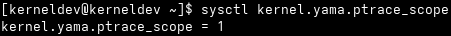
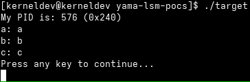
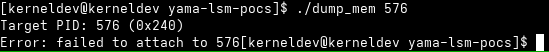
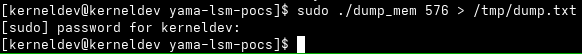
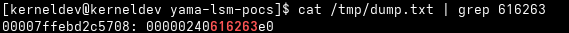
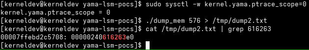
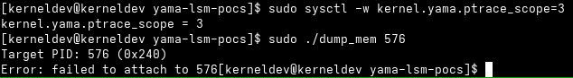
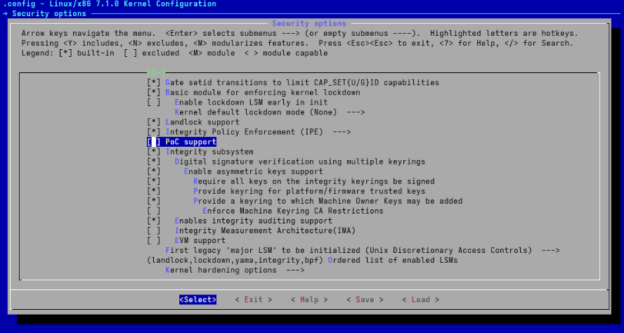
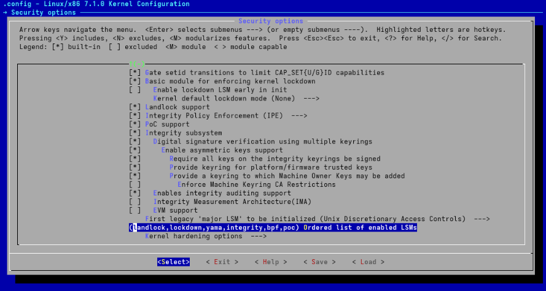
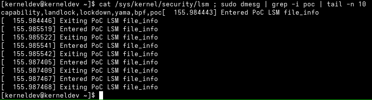

Title: Study notes on the Linux Security Module (LSM) kernel framework--Part 2
Date: 2026-06-25 00:00
Category: Linux


This blog post is a continuation to [my previous study notes](https://vasconcedu.github.io/study-notes-on-the-linux-security-module-lsm-kernel-framework-part-1.html) about the inner workings of the LSM kernel framework. Previously, I've established an understanding of where LSMs are positioned in the kernel's call sequence that leads to accessing system resources, how LSMs initialize, define and register call hooks based on a static calls table data structure.

In this blog post, I aim at understanding how an LSM's codebase integrates into the kernel from a development standpoint, and how one should go about programming an LSM from the ground up. In order to achieve that, I'll look at the functioning of a specific LSM--namely Yama--, by establishing intuition about its threat model, then collecting practical evidence on how it changes the behavior of a live system, and finally moving to looking at its source code to understand its implementation. To conclude, I'll leverage the insights resulting from that exercise to program my own proof of concept LSM and boot into a kernel that loads it to hopefully bring it to life.

### Why Yama?

Before we begin, I should like to clarify why I picked Yama as a case study over the other LSMs in the kernel's codebase. The answer to that is because Yama hits a sweet spot between complexity and simplicity. With less than 500 LOC, only four security hooks, and a very well defined threat model, Yama delivers plenty of material for analysis, but still without being overwhelming to analyze. That said, before we delve into Yama's codebase, let's get a glimpse at the problem that led to its development in first place.

### The threat model that Yama addresses

As stated in [the kernel's documentation for the Yama LSM](https://www.kernel.org/doc/html/latest/admin-guide/LSM/Yama.html):

> "Yama is a Linux Security Module that collects system-wide DAC security protections that are not handled by the core kernel itself."

More specifically, Yama addresses a threat model where processes running under the same user UID may act maliciously toward each other. As obvious as that might read, such threat model has only emerged in the last few decades. In the early days of computing, [processes belonging to the same user were considered equally trusted](https://www.systemshardening.com/articles/linux/linux-ptrace-yama-hardening/). Of course, that premise simply doesn't hold anymore, but what that entails is that historically--as naive as it may appear from a modern security engineering perspective--, certain aspects of operating systems were originally designed with that threat model in mind. Such is the case of [the `ptrace()` syscall](https://man7.org/linux/man-pages/man2/ptrace.2.html). From `man`:

> "The ptrace() system call provides a means by which one process (the "tracer") may observe and control the execution of another process (the "tracee"), and examine and change the tracee's memory and registers. It is primarily used to implement breakpoint debugging and system call tracing."

From the description above, it's not hard to understand why uncontrolled access to `ptrace()` might be troublesome. If a malicious process were able to attach to another process through `ptrace()`, it would have full control not only over the tracee's data, but also over its execution flow, leading to full process compromise.

The way Yama addresses the threat model above is by establishing [four so called "scope levels"](https://www.systemshardening.com/articles/linux/linux-ptrace-yama-hardening/#the-four-scope-levels):

- Scope level 0 is the default kernel policy where any process is able to `ptrace()` processes belonging to the same UID;
- Scope level 1 allows parent processes to trace their children. Processes to whom tracees [explicitly grant permission via `prctl()`](https://man7.org/linux/man-pages/man2/pr_set_ptracer.2const.html) and root are also allowed to `ptrace()` processes;
- Scope level 2 restricts tracing to processes with [capability `CAP_SYS_PTRACE`](https://man7.org/linux/man-pages/man7/capabilities.7.html), such as root user processes; and
- Scope level 3 disables tracing entirely, even to the root user.

When Yama is enabled, the scope level in which it is operating can be examined by issuing: 

```bash
sysctl kernel.yama.ptrace_scope
```

Furthermore, it is possible to change Yama's scope level by issuing:

```bash
sudo sysctl -w kernel.yama.ptrace_scope=<scope level>
```

Where `<scope level>` is the desired Yama scope level.

### How Yama changes the behavior of a live system

Before we delve into Yama's implementation internals, let's see how a live system behaves with respect to Yama's scope levels. To achieve that, we'll perform an anecdotal experiment. I've programmed [a pair of proof of concept user space programs to help in this exercise](https://github.com/vasconcedu/yama-lsm-pocs):

- In the GitHub repository linked above, program `target.c` implements the tracee; and
- Program `dump_mem.c` implements the tracer. It attaches to `target.c`'s process to actively dump part of its memory space--namely 64 words of its stack.

While the idea here is not to exercise the entirety of Yama's functionality and configuration, such programs should help us establish enough intuition about how Yama changes the behavior of a live system before we look at its source code. Program `target.c` is shown below:

```c
#include <stdio.h>
#include <unistd.h>

void f(pid_t pid, char a, char b, char c) {
	printf("My PID is: %d (0x%x)\n", pid, pid);
	printf("a: %c\n", a);
	printf("b: %c\n", b);
	printf("c: %c\n", c);
	printf("Press any key to continue...\n");
	getchar();
}

int main(int argc, char *argv[])
{
	pid_t pid;
	char a, b, c;

	pid = getpid();
	a = 'a'; // 61
	b = 'b'; // 62
	c = 'c'; // 63

	f(pid, a, b, c);

	return 0;
}
```

By inspecting the code above, we see that `target.c` reads its own PID, then passes it as an argument, along with the characters `'a'`, `'b'` and `'c'`, to function `f()`. In turn, `f()` prints all such values to stdout, then waits for the user to press a key before returning, leading to the program exiting.

In turn, `dump_mem.c` expects the tracee's PID as a command line argument, attaches to it while it is waiting for user input at `getchar()`, then does the following:

```c

/* ... */

ptrace(PTRACE_GETREGS, pid, NULL, &regs);
sp = regs.rsp;

for (i = 0; i < 64; ++i) {
	off = sp + i * 8;
	word = ptrace(PTRACE_PEEKDATA, pid,
			      (void *) off, NULL);
	printf("%016lx: %016lx\n", off, word);
}

/* ... */

```

While usage details of `ptrace()` syscalls in user space are out of the scope of this blog post--please look at [the corresponding man page](https://www.man7.org/linux/man-pages/man2/ptrace.2.html) for detail--, the code snippet above shows that `dump_mem.c` first retrieves the tracee's stack pointer, then dumps 64 words starting at the address in SP, namely the 64 topmost words of the tracee's stack. Since the tracee is blocked at `getchar()` while the tracer dumps memory words, function `f()`'s segment is dumped to stdout. The fact that the segment contains the sequence of characters from `'a'` to `'c'`--which translates to the sequence of integers from `61` to `63`--is intentional to aid in spotting it amid dumped data, serving as evidence that we're indeed dumping the tracee's stack.

Let's first take a look at the scope level that is currently configured for Yama in our Arch Linux lab host. If we issue `sysctl kernel.yama.ptrace_scope`, here's what we'll see:



Indicating that the system is at scope level 1, meaning that only a tracee's parent, root processes, or processes to whom the tracee has explicitly granted `PR_SET_PTRACER` via `prctl()` should be able to attach to any given process for tracing. While we won't exhaust these possibilities here, let's see what happens when an unprivileged `dump_mem.c` process tries to attach to `target.c`'s process. First, we run the target process:



The tracee prints its PID to stdout--i.e. 576, or 240 in hexadecimal notation--, along with the arguments to `f()`, and blocks at `getchar()`. That gives us a chance to run the tracer. First, let's run it unprivileged:



As expected, the tracer is unable to attach to the tracee. Let's run it again, this time with root's UID:



And the execution seems to succeed. Indeed, if we look at the output at `/tmp/dump.txt` by issuing `cat /tmp/dump.txt | grep 616263`, here's what we'll see:



Confirming that, indeed, we have dumped the tracee's stack. Not only that, we collected anecdotal evidence that Yama seems to behave--at least partially--as defined in its documentation at scope level 1. Let's move on to another scope level. If we change Yama's scope level to 0 and run the tracer process again, without root privilege:



We confirm that we've been able to dump the tracee's stack, now from an unprivileged tracer--just as expected. Yama's scope level 2 restricts tracing to processes with capability `CAP_SYS_PTRACE`. While `CAP_SYS_PTRACE` is inherent to root processes, scope level 2 differs from scope level 1 in that it only allows `CAP_SYS_PTRACE` processes to perform tracing. For simplicity's sake, we'll skip scope level 2 here, as the limitations inherent to our proof of concept programs would lead to observing system behavior identical to that of scope level 1 in scope level 2--succeeding under root's UID, failing otherwise. Distinguishing between scope levels 1 and 2 would require capability manipulation, which is out of the scope of the exercise herein. That said, let's move on to scope level 3, where tracing is disabled entirely:

> NOTE: Please bear in mind that after changing Yama's scope level to 3, only a reboot will change it back to its original value at scope level 1 as scope level 3 is Yama's maximum security level, and `sysctl` calls are not allowed to change it.



As expected, now, not even root processes are able to attach to the tracee.

That concludes our anecdotal experiment. We've now established enough intuition about Yama's functioning and how it impacts the behavior of a live system, and we can now move on to studying the LSM's implementation at [security/yama/](https://git.kernel.org/pub/scm/linux/kernel/git/torvalds/linux.git/tree/security/yama/).

### A look at Yama's source code

In this section, we'll inspect part of the source code of the Yama LSM with the goal of understanding its implementation well enough to build our own proof of concept LSM later on.

First, let's take a look at Yama's Kconfig file at [security/yama/Kconfig](https://git.kernel.org/pub/scm/linux/kernel/git/torvalds/linux.git/tree/security/yama/Kconfig):

```
# SPDX-License-Identifier: GPL-2.0-only
config SECURITY_YAMA
	bool "Yama support"
	depends on SECURITY
	default n
	help
	  This selects Yama, which extends DAC support with additional
	  system-wide security settings beyond regular Linux discretionary
	  access controls. Currently available is ptrace scope restriction.
	  Like capabilities, this security module stacks with other LSMs.
	  Further information can be found in
	  Documentation/admin-guide/LSM/Yama.rst.

	  If you are unsure how to answer this question, answer N.
```

Kconfig files follow the conventions established in the kernel's [Kconfig language](https://docs.kernel.org/kbuild/kconfig-language.html), and [serve the purpose of defining the configuration interface for kernel features and modules prior to compilation](https://en.wikipedia.org/wiki/Menuconfig).

What Yama's Kconfig file does is [it defines a new configuration option](https://docs.kernel.org/kbuild/kconfig-language.html#menu-entries), namely `SECURITY_YAMA`, [of type `bool`, and input prompt "Yama support"](https://docs.kernel.org/kbuild/kconfig-language.html#menu-attributes). The input prompt is the string that is displayed to the developer at compilation time. Such configuration option defaults to "n"--i.e. "no", meaning that it is disabled by default--, and depends on the `SECURITY` configuration. In turn, the `SECURITY` configuration is defined in the security subsystem's Kconfig file at [`security/Kconfig`](https://git.kernel.org/pub/scm/linux/kernel/git/torvalds/linux.git/tree/security/Kconfig#n73). Here's what it looks like:

```
# ...

config SECURITY
	bool "Enable different security models"
	depends on SYSFS
	depends on MULTIUSER
	help
	  This allows you to choose different security modules to be
	  configured into your kernel.

	  If this option is not selected, the default Linux security
	  model will be used.

	  If you are unsure how to answer this question, answer N.
	  
# ...
```

The help text in the snippet above makes things a lot clearer: in order for us to be able to use any given LSM, the security subsystem's `SECURITY` configuration must be enabled, which explains the dependency specified in Yama's Kconfig.

To conclude, Yama's Kconfig confirms what we've been discussing about Yama with respect to its scope, and adds that it stacks with other LSMs. In practice, this means that [Yama can be used in conjunction with other minor LSMs deployed in a system](https://www.apparmor.net/about/lsm_introduction/).

Having understood Yama's configuration, let's now briefly visit its [Makefile at `/security/yama/Makefile`](https://git.kernel.org/pub/scm/linux/kernel/git/torvalds/linux.git/tree/security/yama/Makefile):

```
# SPDX-License-Identifier: GPL-2.0-only
obj-$(CONFIG_SECURITY_YAMA) := yama.o

yama-y := yama_lsm.o
```

What this file does is it checks whether `CONFIG_SECURITY_YAMA` is enabled in the kernel's `.config` file at compilation time. If so, this results in the build system creating object file `yama.o` by linking `yama_lsm.o`--compiled from `yama_lsm.c`--into the resulting Yama LSM kernel module.

The last file in Yama's codebase is the module's source code itself at [`security/yama/yama_lsm.c`](https://git.kernel.org/pub/scm/linux/kernel/git/torvalds/linux.git/tree/security/yama/yama_lsm.c). We'll now delve into it by breaking it into pieces to make it easier to analyze. The first thing that draws our attention when we open `yama_lsm.c` for inspection is [a list of preprocessor directives specifying Yama's scope levels](https://git.kernel.org/pub/scm/linux/kernel/git/torvalds/linux.git/tree/security/yama/yama_lsm.c#n23):

```c
/* ... */ 

#define YAMA_SCOPE_DISABLED	0
#define YAMA_SCOPE_RELATIONAL	1
#define YAMA_SCOPE_CAPABILITY	2
#define YAMA_SCOPE_NO_ATTACH	3

static int ptrace_scope = YAMA_SCOPE_RELATIONAL;

/* ... */
```

Furthermore, in accordance with what we observed in our anecdotal experiment, we see that Yama defines its default scope level at scope level 1, namely `YAMA_SCOPE_RELATIONAL`. If we scroll further down into the file, we'll find [a couple of familiar data structures](https://git.kernel.org/pub/scm/linux/kernel/git/torvalds/linux.git/tree/security/yama/yama_lsm.c#n419), namely the definition of the LSM's ID and hook list, similar to the ones discussed in [my previous blog post where I case studied AppArmor's hook registration routine](https://vasconcedu.github.io/study-notes-on-the-linux-security-module-lsm-kernel-framework-part-1.html):

```c
/* ... */

static const struct lsm_id yama_lsmid = {
	.name = "yama",
	.id = LSM_ID_YAMA,
};

static struct security_hook_list yama_hooks[] __ro_after_init = {
	LSM_HOOK_INIT(ptrace_access_check, yama_ptrace_access_check),
	LSM_HOOK_INIT(ptrace_traceme, yama_ptrace_traceme),
	LSM_HOOK_INIT(task_prctl, yama_task_prctl),
	LSM_HOOK_INIT(task_free, yama_task_free),
};

/* ... */
```

From the code snippet above, it's interesting to note that Yama initializes a total of four hooks specified in [the LSM interface](https://git.kernel.org/pub/scm/linux/kernel/git/torvalds/linux.git/tree/include/linux/lsm_hook_defs.h), namely:

- [`ptrace_access_check()`](https://docs.kernel.org/core-api/kernel-api.html#c.security_ptrace_access_check): this hook is used to check whether a process should be allowed to trace a child process;
- [`ptrace_traceme()`](https://docs.kernel.org/core-api/kernel-api.html#c.security_ptrace_traceme): this hook is used to check whether the parent of the current process is allowed to trace it prior to having the child process grant the parent tracing permission;
- [`task_prctl()`](https://docs.kernel.org/core-api/kernel-api.html#c.security_task_prctl): this hook is used to check if a `prctl()` operation should be allowed on the current process; and
- [`task_free()`](https://docs.kernel.org/core-api/kernel-api.html#c.security_task_free): this hook is used to free a process' LSM blob.

Furthermore, if we `git grep LSM_ID_YAMA`, we'll find that the LSM's ID is defined at [`include/uapi/linux/lsm.h`](https://git.kernel.org/pub/scm/linux/kernel/git/torvalds/linux.git/tree/include/uapi/linux/lsm.h#n59):

```c
/* ... */

#define LSM_ID_YAMA		105

/* ... */
```

If we scroll further down, we'll find another mandatory code structure, namely [a call to macro `DEFINE_LSM`](https://git.kernel.org/pub/scm/linux/kernel/git/torvalds/linux.git/tree/security/yama/yama_lsm.c#n478), making the LSM framework recognize the Yama LSM by pointing to its ID and init function:

```c
/* ... */

DEFINE_LSM(yama) = {
	.id = &yama_lsmid,
	.init = yama_init,
};

/* ... */
```

Speaking of [Yama's init function](https://git.kernel.org/pub/scm/linux/kernel/git/torvalds/linux.git/tree/security/yama/yama_lsm.c#n470), here's what it looks like:

```c
/* ... */

static int __init yama_init(void)
{
	pr_info("Yama: becoming mindful.\n");
	security_add_hooks(yama_hooks, ARRAY_SIZE(yama_hooks), &yama_lsmid);
	yama_init_sysctl();
	return 0;
}

/* ... */
```

From the code snippet above, we see that all the init function does is it registers Yama's hook list by calling `security_add_hooks()`--again, I already examined this process while case studying AppArmor in [my previous blog post about the kernel's LSM framework](https://vasconcedu.github.io/study-notes-on-the-linux-security-module-lsm-kernel-framework-part-1.html), so I won't get into the details here--, and initializes the LSM's `sysctl` interface with a call to `yama_init_sysctl()`. Thus, part of Yama's codebase deals with the LSM's `sysctl` administration interface, and part deals with the security hooks themselves.

We'll now focus on the latter and delve into one of Yama's hook definitions, namely [`yama_ptrace_access_check()`](https://git.kernel.org/pub/scm/linux/kernel/git/torvalds/linux.git/tree/security/yama/yama_lsm.c#n349), whose code I've reproduced below for convenience. What follows is an analysis of its inner workings:

```c
/* ... */

static int yama_ptrace_access_check(struct task_struct *child,
				    unsigned int mode)
{
	int rc = 0;

	/* require ptrace target be a child of ptracer on attach */
	if (mode & PTRACE_MODE_ATTACH) {
		switch (ptrace_scope) {
		case YAMA_SCOPE_DISABLED:
			/* No additional restrictions. */
			break;
		case YAMA_SCOPE_RELATIONAL:
			rcu_read_lock();
			if (!pid_alive(child))
				rc = -EPERM;
			if (!rc && !task_is_descendant(current, child) &&
			    !ptracer_exception_found(current, child) &&
			    !ns_capable(__task_cred(child)->user_ns, CAP_SYS_PTRACE))
				rc = -EPERM;
			rcu_read_unlock();
			break;
		case YAMA_SCOPE_CAPABILITY:
			rcu_read_lock();
			if (!ns_capable(__task_cred(child)->user_ns, CAP_SYS_PTRACE))
				rc = -EPERM;
			rcu_read_unlock();
			break;
		case YAMA_SCOPE_NO_ATTACH:
		default:
			rc = -EPERM;
			break;
		}
	}

	if (rc && (mode & PTRACE_MODE_NOAUDIT) == 0)
		report_access("attach", child, current);

	return rc;
}

/* ... */
```

By inspecting the code snippet above, we see that `yama_ptrace_access_check()` expects two arguments, namely `child`, a [struct of type `struct task_struct` defined at `include/linux/sched.h`, representing the process that the current process is trying to `ptrace()`](https://git.kernel.org/pub/scm/linux/kernel/git/torvalds/linux.git/tree/include/linux/sched.h#n826), and an integer containing ORed [`PTRACE_MODE_*` flags](https://www.man7.org/linux/man-pages/man2/ptrace.2.html), defining the `ptrace()` access mode of the operation in question.

First, the function defines its return value, namely `rc`, whose value is initialized to `0`, [which translates to a permission grant](https://git.kernel.org/pub/scm/linux/kernel/git/torvalds/linux.git/tree/include/linux/sched.h#n826). What follows is a check of whether the `PTRACE_MODE_*` flag contains [a write operation](https://www.man7.org/linux/man-pages/man2/ptrace.2.html), in which case the function switches `ptrace_scope`--i.e. Yama's current scope level--, branching to specific routines according to the scope level found.

At scope level 0--i.e. `YAMA_SCOPE_DISABLED`--, the case breaks and returns immediately. At scope level 3--i.e. `YAMA_SCOPE_NO_ATTACH`--, the function assigns `rc` to `-EPERM`, indicating that the hook reached a state of insufficient permission, then the case breaks and the function falls into a check of whether `PTRACE_MODE_*` does not contain `PTRACE_MODE_NOAUDIT`. [Such flag is used in certain use cases to indicate that the access should not be added to audit logs](https://www.man7.org/linux/man-pages/man2/ptrace.2.html). If it is not present, the function goes on to call `report_access()` to log the fact that the `ptrace()` syscall resulted in a failure to attach.

Now, let's look at the other cases. Scope level 1--i.e. `YAMA_SCOPE_RELATIONAL`--results in the following routine:

- First, the function acquires [the thread's RCU read lock](https://docs.kernel.org/RCU/whatisRCU.html#rcu-read-lock), ensuring that the task data structures that it manipulates in the routine aren't deallocated prior to it exiting the critical region where it reads them;
- Next, it checks to see whether the child process is not dead, and if it is, the function assigns `rc` to `-EPERM`, and the routine concludes with the release of the RCU read lock, with the case breaking and the aforementioned check regarding logging being performed;
- In turn, if `rc` is still `0` at this point, the actual permission checks are performed, and if all of them fail, `rc` is assigned to `-EPERM`, the lock is released, the case breaks, and the very same check as before regarding logging is performed. Let's now step into the permission checks that this step actually entails.

The first permission check is `!task_is_descendant(current, child)`. [`task_is_descendant()`](https://git.kernel.org/pub/scm/linux/kernel/git/torvalds/linux.git/tree/security/yama/yama_lsm.c#n267) checks whether `child` is a descendant of `current`, returning `1` in case it is, and `0` otherwise. Thus, `!task_is_descendant(current, child)` resolves to `1` when `child` is not a descendant of `current`.

The second permission check is `!ptracer_exception_found(current, child)`. [`ptracer_exception_found()`](https://git.kernel.org/pub/scm/linux/kernel/git/torvalds/linux.git/tree/security/yama/yama_lsm.c#n300) checks whether `current` is an authorized tracer of `child`, either due to `current` belonging to the same thread group as `child`'s parent or due to `child` having actively `prctl()`ed to grant `current` tracer permission, returning `1` in case `current` is an authorized tracer of `child`, and `0` otherwise. Thus, `!ptracer_exception_found(current, child)` resolves to `1` when `current` is not allowed to trace `child`.

Lastly, the third permission check is `!ns_capable(__task_cred(child)->user_ns, CAP_SYS_PTRACE)`. [`ns_capable()`](https://git.kernel.org/pub/scm/linux/kernel/git/torvalds/linux.git/tree/kernel/capability.c#n361) is a function defined at [kernel/capability.c](https://git.kernel.org/pub/scm/linux/kernel/git/torvalds/linux.git/tree/kernel/capability.c) that takes [a struct of type `struct user_namespace`](https://git.kernel.org/pub/scm/linux/kernel/git/torvalds/linux.git/tree/include/linux/user_namespace.h#n76)--containing data such as the respective task owner's UID and GID, among other security-related fields--, and checks whether the current process has a given capability in that namespace, returning `1` if so, and `0` otherwise. More specifically, the call herein takes the user namespace field of the `child`'s [task credentials](https://docs.kernel.org/security/credentials.html)--i.e. the [security context of `child`](https://git.kernel.org/pub/scm/linux/kernel/git/torvalds/linux.git/tree/include/linux/cred.h#n115)--, and checks to see if the current process has `CAP_SYS_PTRACE` in said user namespace, in which case it should be allowed to trace `child`. Thus, `!ns_capable(__task_cred(child)->user_ns, CAP_SYS_PTRACE)` resolves to `1` when the current process does not have `CAP_SYS_PTRACE` in `child`'s namespace.

To conclude, scope level 2--i.e. `YAMA_SCOPE_CAPABILITY`--leads to executing the same permission check discussed in the paragraph above.

All in all, we see that `yama_ptrace_access_check()` performs LSM context-specific checks regarding internal kernel data structures to take decisions on whether access to certain resources that the LSM aims at protecting should be allowed or not, resulting in the hook returning `0` when access should be granted, and `-EPERM` otherwise. The other hooks adopt the same behavior, and apart from the configuration and compilation infrastructures, and the `sysctl` interface that Yama exports, the core infrastructure of the LSM is entirely built around the hooks and their auxiliary functions, constituting the code that allows the LSM to make said access decisions on behalf of the kernel.

That understanding seems enough for us to dare building our own proof of concept LSM now. From this point onward, that's precisely what we'll do.

### Building a proof of concept LSM

We'll now work towards building a proof of concept LSM that simply implements a given hook and prints kernel log messages whenever said hook is called. The intent here is to exercise the integration of an LSM into the kernel's codebase.

First off, we'll create a new diretory at `security/poc/` and populate it with files `Kconfig`, `Makefile`, and `poc.c`. Next, we'll fill in `Kconfig` and `Makefile` based on what we learned from looking at Yama's codebase. Here's what our `Kconfig` looks like:

```
# SPDX-License-Identifier: GPL-2.0-only
config SECURITY_POC
	bool "PoC support"
	depends on SECURITY
	default n
	help
	  This selects the PoC LSM.
```

And the module's `Makefile`:

```
# SPDX-License-Identifier: GPL-2.0-only
obj-$(CONFIG_SECURITY_POC) := poc.o

poc-y := poc.o
```

Next, we'll program the module itself by writing `poc.c`. We'll start by including basic LSM headers and code structures, namely the LSM's ID, init function, and macro definition:

```c
// SPDX-License-Identifier: GPL-2.0-only

#include <linux/lsm_hooks.h>
#include <uapi/linux/lsm.h>

static const struct lsm_id poc_lsmid = {
	.name = "poc",
	.id = LSM_ID_POC,
};

static int __init poc_lsm_init(void)
{
	pr_info("PoC LSM active\n");
	return 0;
}

DEFINE_LSM(poc) = {
	.id = &poc_lsmid,
	.init = poc_lsm_init,
};
```

Of course, as we've seen, we must also define `LSM_ID_POC` in [`include/uapi/linux/lsm.h`](https://git.kernel.org/pub/scm/linux/kernel/git/torvalds/linux.git/tree/include/uapi/linux/lsm.h). Let's go ahead and add a new LSM ID at the end of the ID list and assign our PoC LSM the next available ID in the sequence:

```c
/* ... */

#define LSM_ID_EVM		112
#define LSM_ID_IPE		113
#define LSM_ID_POC		114

/* ... */
```

In turn, let's define a hook. We'll have our PoC LSM define a single hook, namely [`file_open()`](https://git.kernel.org/pub/scm/linux/kernel/git/torvalds/linux.git/tree/include/linux/lsm_hook_defs.h#n215), to have the kernel call our LSM everytime a file is opened. Let's now create our hook list containing that single hook and a hook implementation for it. We'll also add a call to `security_add_hooks()` to the LSM's init function in order for us to register our hook:

```c
// SPDX-License-Identifier: GPL-2.0-only

#include <linux/lsm_hooks.h>
#include <uapi/linux/lsm.h>

static const struct lsm_id poc_lsmid = {
	.name = "poc",
	.id = LSM_ID_POC,
};

static int poc_file_open(struct file *file)
{
	pr_info("Entered PoC LSM file_info\n");
	
	/* Do something */
	
	pr_info("Exiting PoC LSM file_info\n");
	return 0;
}

static struct security_hook_list poc_lsm_hooks[] __ro_after_init = {
	LSM_HOOK_INIT(file_open, poc_file_open),
};

static int __init poc_lsm_init(void)
{
	security_add_hooks(poc_lsm_hooks, ARRAY_SIZE(poc_lsm_hooks),
			   &poc_lsmid);
	pr_info("PoC LSM active\n");
	return 0;
}

DEFINE_LSM(poc) = {
	.id = &poc_lsmid,
	.init = poc_lsm_init,
};

```

> NOTE: in the paragraphs that follow, we'll address some further changes that we'll need to make to the kernel's codebase before we're able to compile and boot into a kernel with our PoC LSM enabled. I had missed them in my initial exploration of Yama's codebase documented above, and I only understood my mistake after some additional rounds of trial and error.

As obvious as it may seem now, I had missed the need to change both the security subsystem's Kconfig file at [`security/Kconfig`](https://git.kernel.org/pub/scm/linux/kernel/git/torvalds/linux.git/tree/security/Kconfig) to source our own PoC LSM's Kconfig file, and its Makefile at [`security/Makefile`](https://git.kernel.org/pub/scm/linux/kernel/git/torvalds/linux.git/tree/security/Makefile) to add the object file from our newly created `security/poc/` security subsystem subdirectory.

That said, we must instruct the security subsystem's Kconfig file to source that of our own PoC module, and while we're at it, we'll also add our LSM to the lists of enabled LSMs in the default configurations section of `security/Kconfig`:

```
# ...

source "security/landlock/Kconfig"
source "security/ipe/Kconfig"
source "security/poc/Kconfig"

# ... 

config LSM
	string "Ordered list of enabled LSMs"
	depends on SECURITY
	default "landlock,lockdown,yama,loadpin,safesetid,smack,selinux,tomoyo,apparmor,ipe,bpf,poc" if DEFAULT_SECURITY_SMACK
	default "landlock,lockdown,yama,loadpin,safesetid,apparmor,selinux,smack,tomoyo,ipe,bpf,poc" if DEFAULT_SECURITY_APPARMOR
	default "landlock,lockdown,yama,loadpin,safesetid,tomoyo,ipe,bpf,poc" if DEFAULT_SECURITY_TOMOYO
	default "landlock,lockdown,yama,loadpin,safesetid,ipe,bpf,poc" if DEFAULT_SECURITY_DAC
	default "landlock,lockdown,yama,loadpin,safesetid,selinux,smack,tomoyo,apparmor,ipe,bpf,poc"
	help

# ...
```

Next, we must implement the change to `security/Makefile`, adding the object files from `security/poc/`:

```
# ...

obj-$(CONFIG_SECURITY_LANDLOCK)		+= landlock/
obj-$(CONFIG_SECURITY_IPE)		+= ipe/
obj-$(CONFIG_SECURITY_POC)		+= poc/

# ...
```

After doing the above, we can finally `cd` into the repository's root and `source Kconfig`. Now, if we `make menuconfig` and look at the security subsystem's configuration submenu, here's what it looks like:



We can now activate our PoC module by toggling its option and adding it to the enabled LSM's list, whose value seems to have been obtained from our previous configuration:



Finally, we can save the configuration and proceed to compiling and installing the kernel as usual. After booting into the new kernel, if we look at the list of enabled LSMs, we'll see our PoC LSM listed. Furthermore, the kernel log displays the messages our LSM has been printing every time a file is opened, proving that the kernel is indeed calling the `file_open()` hook that our LSM registered:



### Conclusion

This second part of my LSM study notes addressed the integration of a new LSM built from the ground up to the kernel's codebase. We looked at the threat model and the implementation of an already existing LSM, namely Yama, and by leveraging the knowledge that we acquired from inspecting its codebase, we've successfully built a proof of concept LSM and integrated it to the kernel's build system, allowing us to boot into a kernel that loads it and to inspect its functioning.

By changing the security subsystem to add our own proof of concept LSM, we've learned that extending ther kernel's security subsystem is within arm's reach of anyone willing to venture into navigating its codebase and persisting in making things work out. Not only that, it made me a lot more confident about my basic understanding of an LSM built into the Linux kernel, and it helped me consolidate some of my learnings from part 1 of this series.

I'm not sure where I'll go with respect to part 3 of this blog post series. I might further extend the proof of concept LSM defined herein to implement some actual policy enforcement by establishing an actual threat model for it to address. Additionally, one takeaway of exploring Yama's codebase was noticing the need to deeply understand the different kernel data structures that form the basis of the security checks that LSMs implement, and I might look into that next. Another possibility is further delving into the kernel's generic LSM infrastructure--there's a lot more to look at--while further case studying a major LSM such as AppArmor to see what actual LSM implementations look like. All in all, I'm not sure what my next step will be, but at least I've got some options mapped.

_Happy hacking._
