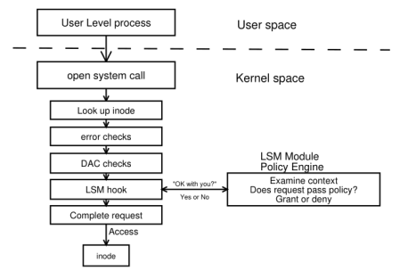

Title: Study notes on the Linux Security Module (LSM) kernel framework--Part 1
Date: 2026-06-03 00:00
Category: Linux


My journey in Linux systems programming has been advancing quite well, and during the last month or so, I've been really delving into the Linux Security Module (LSM) kernel framework, in an attempt to get a grasp of its inner workings and to prepare the ground for my studies on specific LSMs later on.

Even though I've been trying to focus on the framework itself, it's inevitable to look at LSM module implementations along the way, and I've been case studying AppArmor. In fact, I found a rather interesting bug in AppArmor's `lsm.c` along the way and patched it, so my studies resulted in the opportunity to submit [a new patch](https://lore.kernel.org/all/20260521151314.8683-1-eduardo@eduardovasconcelos.com/) to upstream, with another one in the oven. Another side effect was submitting [a pedantic merge request to AppArmor's documentation](https://gitlab.com/apparmor/apparmor.net/-/merge_requests/59).

What I realized is that LSM is a topic whose documentation is rather fragmented, and this blog post is an attempt to consolidate what I've learned so far from consuming a rather diverse range of documentation sources and navigating LSM sources in the kernel's codebase.

### LSM's debut

In their paper [_Linux Security Module Framework_](https://www.kernel.org/doc/ols/2002/ols2002-pages-604-617.pdf), early LSM developers report that back in the 2001 Linux Kernel Summit, NSA presented their work in SELinux. Linus Torvalds accepted the need for an access control framework in the kernel, but he preferred to have security modules implemented as loadable kernel modules that could be easily exchanged, while remaining simple, efficient, and non-intrusive.

### Major vs. minor LSM modules

The LSM framework distinguishes between two categories of LSM modules, namely major and minor. Major LSM modules implement full Mandatory Access Control (MAC) and are mutually exclusive, meaning one cannot run two major LSM modules at once--such as AppArmor and SELinux, for instance. In turn, minor LSM modules implement specific security features and can be stacked on top of each other.

Ordinary systems usually run one major LSM and a several minor ones. Loaded LSM modules can be listed by issuing:

```bash
cat /sys/kernel/security/lsm
```

### Basic design

LSM was designed in such a way as to remain agnostic to the different approaches to access control that security modules implement. In order to achieve this, the LSM mediates access to the kernel's internal objects by interfacing with loaded LSM modules. The diagram below, extracted from the aforementioned _Linux Security Module Framework_ paper, illustrates this concept.



The diagram shows that whenever a process in user space executes a syscall, it passes through the existing kernel logic, including DAC. Just before accessing the object that is the intended target of the syscall, an LSM hook makes a call to the LSM module asking whether it allows the access to proceed. In turn, the module responds either allowing or denying access to the object.

### LSM hook definitions

Based on that description, it is easy to notice that hooks constitute a core element in the design of the LSM framework. In fact, an important component of the LSM is precisely the definition of its hook interface at [`include/linux/lsm_hook_defs.h`](https://git.kernel.org/pub/scm/linux/kernel/git/torvalds/linux.git/tree/include/linux/lsm_hook_defs.h).

For each hook, `lsm_hook_defs.h` invokes the macro `LSM_HOOK`, specifying the hook's return type, default value, name, and argument list. Take [the following line](https://git.kernel.org/pub/scm/linux/kernel/git/torvalds/linux.git/tree/include/linux/lsm_hook_defs.h#n215), for instance:

```c
LSM_HOOK(int, 0, file_open, struct file *file)
```

Here, `LSM_HOOK` defines hook `file_open`, whose return type is `int` with default value `0`, and whose only argument is a pointer to `struct file`.

### The static calls table

> WARNING: things might get rather convoluted from this point onwards, but there's no way around it, really.

Each hook in `lsm_hook_defs.h` is added to a static calls table defined in [`security/security.c`](https://git.kernel.org/pub/scm/linux/kernel/git/torvalds/linux.git/tree/security/security.c#n139).

`security.c` includes [`include/linux/lsm_hooks.h`](https://git.kernel.org/pub/scm/linux/kernel/git/torvalds/linux.git/tree/include/linux/lsm_hooks.h) ([here](https://git.kernel.org/pub/scm/linux/kernel/git/torvalds/linux.git/tree/security/security.c#n21)), which in turn includes the aforementioned `lsm_hook_defs.h`, right at the [definition of `struct lsm_static_calls_table`](https://git.kernel.org/pub/scm/linux/kernel/git/torvalds/linux.git/tree/include/linux/lsm_hooks.h#n67):

```c
struct lsm_static_calls_table {
	#define LSM_HOOK(RET, DEFAULT, NAME, ...) \
		struct lsm_static_call NAME[MAX_LSM_COUNT];
	#include <linux/lsm_hook_defs.h>
	#undef LSM_HOOK
} __packed __randomize_layout;
```

We'll get back to that struct in a minute, but first, let's take a look at its realization in `security.c`:

```c
struct lsm_static_calls_table
	static_calls_table __ro_after_init __aligned(sizeof(u64)) = {
#define INIT_LSM_STATIC_CALL(NUM, NAME)					\
	(struct lsm_static_call) {					\
		.key = &STATIC_CALL_KEY(LSM_STATIC_CALL(NAME, NUM)),	\
		.trampoline = LSM_HOOK_TRAMP(NAME, NUM),		\
		.active = &SECURITY_HOOK_ACTIVE_KEY(NAME, NUM),		\
	},
#define LSM_HOOK(RET, DEFAULT, NAME, ...)				\
	.NAME = {							\
		LSM_DEFINE_UNROLL(INIT_LSM_STATIC_CALL, NAME)		\
	},
#include <linux/lsm_hook_defs.h>
#undef LSM_HOOK
#undef INIT_LSM_STATIC_CALL
	};
```

Now, the code above is certainly hard to grasp at first glance. In order to understand what on Earth is going on here, one needs to break it down and look at it one piece at a time.

As we've already seen, `static_calls_table` is of type `struct lsm_static_calls_table`, and the very first `#define` directive in that type expands each aforementioned `LSM_HOOK` from `lsm_hook_defs.h` into an array of [`struct lsm_static_call`](https://git.kernel.org/pub/scm/linux/kernel/git/torvalds/linux.git/tree/include/linux/lsm_hooks.h#n51) of size `MAX_LSM_COUNT`. Let's take a look at type `struct lsm_static_call`:

```c
struct lsm_static_call {
	struct static_call_key *key;
	void *trampoline;
	struct security_hook_list *hl;
	struct static_key_false *active;
} __randomize_layout;
```

At this point in our introspection, we see that `struct lsm_static_call` is composed of:

- A pointer to a static call key, which in turn essentially points to a target function (see [`include/linux/static_call_types.h`](https://git.kernel.org/pub/scm/linux/kernel/git/torvalds/linux.git/tree/include/linux/static_call_types.h#n63) for detail);
- A pointer to what's called the [trampoline function](https://en.wikipedia.org/wiki/Trampoline_(computing))--i.e. an assembly function that provides a way of calling the function pointed to by the static call key, respecting architecture-specific calling conventions;
- A pointer to the hook list to which this static call belongs, which in turn maps directly to a specific LSM (see [`include/linux/lsm_hooks.h`](https://git.kernel.org/pub/scm/linux/kernel/git/torvalds/linux.git/tree/include/linux/lsm_hooks.h#n95) for detail); and
- A pointer to a struct that tracks whether the static call is active or not--i.e. whether it's been activated by the LSM to which it belongs (see [`include/linux/jump_label.h`](https://git.kernel.org/pub/scm/linux/kernel/git/torvalds/linux.git/tree/include/linux/jump_label.h#n355) for detail).

Finally [annotation `__randomize_layout`](https://lwn.net/Articles/722293/) serves the purpose of randomizing the struct's layout for security.

After establishing this intuition about `struct lsm_static_call`, we can go back to `lsm_static_calls_table`. I've repeated the corresponding code below for convenience: 

```c
struct lsm_static_calls_table {
	#define LSM_HOOK(RET, DEFAULT, NAME, ...) \
		struct lsm_static_call NAME[MAX_LSM_COUNT];
	#include <linux/lsm_hook_defs.h>
	#undef LSM_HOOK
} __packed __randomize_layout;
```

So essentially, if the hooks in `lsm_hook_defs.h` were named "eeny", "meeny", "miny", and "moe", `struct lsm_static_calls_table` would expand into something like:

```c
struct lsm_static_calls_table {
    struct lsm_static_call eeny[MAX_LSM_COUNT],
    struct lsm_static_call meeny[MAX_LSM_COUNT],
    struct lsm_static_call miny[MAX_LSM_COUNT],
    struct lsm_static_call moe[MAX_LSM_COUNT]
}
```

Hence, each hook names a static calls array. With that in mind, let's get back to the realization of `struct lsm_static_calls_table` in `security.c`--also repeated below for convenience--, and analyze what code the preprocessor actually generates:

```c
struct lsm_static_calls_table
	static_calls_table __ro_after_init __aligned(sizeof(u64)) = {
#define INIT_LSM_STATIC_CALL(NUM, NAME)					\
	(struct lsm_static_call) {					\
		.key = &STATIC_CALL_KEY(LSM_STATIC_CALL(NAME, NUM)),	\
		.trampoline = LSM_HOOK_TRAMP(NAME, NUM),		\
		.active = &SECURITY_HOOK_ACTIVE_KEY(NAME, NUM),		\
	},
#define LSM_HOOK(RET, DEFAULT, NAME, ...)				\
	.NAME = {							\
		LSM_DEFINE_UNROLL(INIT_LSM_STATIC_CALL, NAME)		\
	},
#include <linux/lsm_hook_defs.h>
#undef LSM_HOOK
#undef INIT_LSM_STATIC_CALL
	};
```

Here, [`__ro_after_init` is a kernel self-protection annotation](https://www.kernel.org/doc/html/latest/security/self-protection.html) that serves the purpose of marking `static_calls_table` as read only after initialization, meaning that it will live in the kernel's read only data section at `.ro-data` instead of `.data`, benefiting from the kernel's strict memory permissions and preventing the struct from being written, resulting in potential tampering with LSM execution flow. In turn, `__aligned(sizeof(u64))` serves the purpose of preventing unaligned access to the table, which may result in faults in some architectures.

The second `#define` directive expands the hooks defined in `lsm_hook_defs.h` to initialize the static calls array for each hook. It leverages another code generation mechanism to do that, namely `LSM_DEFINE_UNROLL`. Here's [its definition](https://git.kernel.org/pub/scm/linux/kernel/git/torvalds/linux.git/tree/security/security.c#n105):

```c
#define LSM_DEFINE_UNROLL(M, ...) UNROLL(MAX_LSM_COUNT, M, __VA_ARGS__)
```

Now, what that macro does is it takes macro `M` and expands it `MAX_LSM_COUNT` times. Combining that with the first `#define` directive that defines `INIT_LSM_STATIC_CALL` means that each hook "eeny" in `lsm_hook_defs.h`, will expand into an array like:

```
.eeny {
    struct lsm_static_call { /* ... */ }, /* 0 */
    struct lsm_static_call { /* ... */ }, /* 1 */
    ...
    struct lsm_static_call { /* ... */ } /* MAX_LSM_COUNT - 1 */
}
```

Of course, each `struct lsm_static_call` is populated accordingly, and it shall have its fields updated at kernel initialization later on, when each LSM module has the opportunity to register its hooks. The following section documents this process.

### Hook registration

If we look at [LSM initialization](https://git.kernel.org/pub/scm/linux/kernel/git/torvalds/linux.git/tree/init/main.c#n1199) at [`security_init()`](https://git.kernel.org/pub/scm/linux/kernel/git/torvalds/linux.git/tree/security/lsm_init.c#n485), we'll find the following code:

```c
int __init security_init(void)
{

    /* ... */

    cnt = 0;
	lsm_order_for_each(lsm) {
		/* skip the "early" LSMs as they have already been setup */
		if (cnt++ < lsm_count_early)
			continue;
		lsm_init_single(*lsm);
	}

	return 0;
}
```

And if we step into `lsm_init_single()`:

```c
static void __init lsm_init_single(struct lsm_info *lsm)
{
    /* ... */

    ret = lsm->init();

    /* ... */
}
```

So, what's happening here is that the kernel is calling each LSM's `init()` function in order to initialize it.

Next, we'll try to understand what exactly the `init()` function of an LSM module does in order to register hooks, by looking at AppArmor's initialization.

### LSM initialization: a case study of AppArmor

AppArmor's initialization is at [`security/apparmor/lsm.c`](https://git.kernel.org/pub/scm/linux/kernel/git/torvalds/linux.git/tree/security/apparmor/lsm.c#n2499). Here's what we'll find more or less half way through the module's init function: 

```c
static int __init apparmor_init(void)
{
    /* ... */

    security_add_hooks(apparmor_hooks, ARRAY_SIZE(apparmor_hooks),
				&apparmor_lsmid);

    /* ... */
}
```

The function calls [`security_add_hooks()`]((https://git.kernel.org/pub/scm/linux/kernel/git/torvalds/linux.git/tree/security/lsm_init.c#n369)), providing [`apparmor_hooks`--AppArmor's hook list--](https://git.kernel.org/pub/scm/linux/kernel/git/torvalds/linux.git/tree/security/apparmor/lsm.c#n1656), along with the size of said hook list and AppArmor's LSM ID.

`apparmor_hooks` is [defined as](https://git.kernel.org/pub/scm/linux/kernel/git/torvalds/linux.git/tree/security/apparmor/lsm.c#n1656):

```c
static struct security_hook_list apparmor_hooks[] __ro_after_init = {
	LSM_HOOK_INIT(ptrace_access_check, apparmor_ptrace_access_check),
	LSM_HOOK_INIT(ptrace_traceme, apparmor_ptrace_traceme),
	LSM_HOOK_INIT(capget, apparmor_capget),
	LSM_HOOK_INIT(capable, apparmor_capable),

	LSM_HOOK_INIT(move_mount, apparmor_move_mount),
	LSM_HOOK_INIT(sb_mount, apparmor_sb_mount),
	LSM_HOOK_INIT(sb_umount, apparmor_sb_umount),
	LSM_HOOK_INIT(sb_pivotroot, apparmor_sb_pivotroot),

    /* ... */
```

Which translates to an array of mappings of type [`struct security_hook_list`](https://git.kernel.org/pub/scm/linux/kernel/git/torvalds/linux.git/tree/include/linux/lsm_hooks.h#n95), each mapping an LSM hook to an AppArmor implementation of that hook. The definition of `struct security_hook_list` is as follows:

```c
struct security_hook_list {
	struct lsm_static_call *scalls;
	union security_list_options hook;
	const struct lsm_id *lsmid;
} __randomize_layout;
```

The struct contains a list of static calls as `scalls`--you might want to revisit the definition of [`struct lsm_static_call`](https://git.kernel.org/pub/scm/linux/kernel/git/torvalds/linux.git/tree/include/linux/lsm_hooks.h#n51)--, a union of type [`union security_list_options`](https://git.kernel.org/pub/scm/linux/kernel/git/torvalds/linux.git/tree/include/linux/lsm_hooks.h#n38), and a pointer to the LSM's ID.

If we introspect into `security_list_options`, here's what we'll find:

```c
union security_list_options {
	#define LSM_HOOK(RET, DEFAULT, NAME, ...) RET (*NAME)(__VA_ARGS__);
	#include "lsm_hook_defs.h"
	#undef LSM_HOOK
	void *lsm_func_addr;
};
```

Thus, the union expands the definitions of `LSM_HOOK` from `lsm_hook_defs.h` into a list of function pointers to each LSM hook. In turn, macro [`LSM_HOOK_INIT`](https://git.kernel.org/pub/scm/linux/kernel/git/torvalds/linux.git/tree/include/linux/lsm_hooks.h#n137) translates to:

```c
#define LSM_HOOK_INIT(NAME, HOOK)			\
	{						\
		.scalls = static_calls_table.NAME,	\
		.hook = { .NAME = HOOK }		\
	}
```

Namely, it initializes `struct security_hook_list.scalls` with a pointer to the array in `static_calls_table` that corresponds to the LSM hook, and `struct security_hook_list.security_list_options.hook`'s field corresponding to the name of the given LSM hook with a pointer to AppArmor's implementation of the hook.

Putting it all together, this results in `apparmor_hooks` expanding into something like:

```c
apparmor_hooks = {
    struct security_hook_list {
        .scalls = static_calls_table.lsm_hook_0,
	    .hook = { .lsm_hook_0 = .apparmor_hook_0 },
	    .lsmid = /* ... */
    },
    struct security_hook_list {
        .scalls = static_calls_table.lsm_hook_1,
	    .hook = { .lsm_hook_1 = .apparmor_hook_1 },
	    .lsmid = /* ... */
    },

    /* ... */
}
```

Hence, each slot in `apparmor_hooks` keeps a reference to a specific LSM hook's array in `static_calls_table`, along with the mapping of said LSM hook to AppArmor's implementation.

### The final steps of hook registration

After looking at AppArmor's initialization to understand what the data structure provided as an argument to `security_add_hooks()` looks like, we can resume our analysis of LSM hook registration by finally stepping into that function:

```c
void __init security_add_hooks(struct security_hook_list *hooks, int count,
			       const struct lsm_id *lsmid)
{
	int i;

	for (i = 0; i < count; i++) {
		hooks[i].lsmid = lsmid;
		if (lsm_static_call_init(&hooks[i]))
			panic("exhausted LSM callback slots with LSM %s\n",
			      lsmid->name);
	}
}
```

We see that `security_add_hooks` iterates through the security hook list initializing the static calls of the given LSM, which if you'll remember were supposed to be updated at kernel initialization--i.e. precisely where we are at this point.

Let's get deeper into our introspection and step into [`lsm_static_call_init()`](https://git.kernel.org/pub/scm/linux/kernel/git/torvalds/linux.git/tree/security/lsm_init.c#n341):

```c
static int __init lsm_static_call_init(struct security_hook_list *hl)
{
	struct lsm_static_call *scall = hl->scalls;
	int i;

	for (i = 0; i < MAX_LSM_COUNT; i++) {
		/* Update the first static call that is not used yet */
		if (!scall->hl) {
			__static_call_update(scall->key, scall->trampoline,
					     hl->hook.lsm_func_addr);
			scall->hl = hl;
			static_branch_enable(scall->active);
			return 0;
		}
		scall++;
	}

	return -ENOSPC;
}
```

At this stage, the function locates the first empty slot in the `static_calls_table` array corresponding to the LSM hook being registered, and then updates that slot by associating it with the LSM module's implementation of the hook.

This way, the LSM should be able to query the LSM module that registered that hook for access approval.

### Conclusion

Wrapping up this first part of my study notes on LSM, I'll say that I'm happy with what I've learned so far.

I've only scratched the surface of the LSM framework, but the elegantly simple inner workings I've touched so far have already proven to be a masterpiece in software engineering, from its solid design principles to the intricante relationship between its static calls table and its hook registration routines. Every layer of it has deepened my appreciation for Linux.

But again, I've only scratched the surface. There's so much more to learn about LSM, and I still want to go deeper into AppArmor and then SELinux. This rabbit hole goes much deeper than what I initially envisioned, but I'm eager to dive in.

When I post Part 2 of these study notes, I hope to have more kernel patches to share and a much deeper understanding of the LSM to offer.

_Happy hacking._