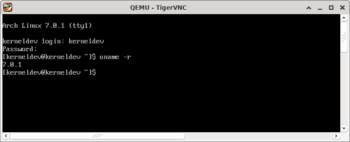

Title: Linux kernel development setup in Arch Linux
Category: Linux
Date: 22-04-2026 19:00


I've been working on [Linux Foundation's kernel development course (LFD103)](https://training.linuxfoundation.org/training/a-beginners-guide-to-linux-kernel-development-lfd103/), and I have chosen a virtual Arch box running on top of a physical Arch host as my kernel development machine. I have found that Arch Linux is by no means a straightforward distro to setup for kernel development. [kernel.org recommends a few dependencies](https://www.kernel.org/doc/html/latest/process/changes.html) that aren't even packaged for Arch and must be built manually. Furthermore, configuring GRUB to boot a newly compiled kernel in Arch is not hard, but it's not as straightforward as for the recommended distros--LFD103 recommends using either Ubuntu or Debian.

In the end, I have succeeded in compiling a kernel image from upstream and booting it using my Arch setup, but not without having to overcome several difficulties first. The post herein aims at documenting this process. It assumes prior knowledge in Arch Linux installation and some knowledge in Linux virtualization and general system administration.

### Partitioniong and installation

It's no surprise one must save extra space in `/boot` to pursue kernel development. LFD103 recommends saving at least 3 GiB. I went with 4 GiB, saved another 4 GiB for swapping, and left 40 GiB for my root filesystem, totalling 48 GiB for my virtual drive. 

I opted for a minimal Arch installation, with `emacs` and `openssh` as extra packages. I also enabled `root` and created a sudoer user. 

### SSH setup

I've then configured an SSH server to allow me to access the development machine from my host system.

### Packaged development dependencies

After logging in through SSH and configuring `~/.emacs` to suit my preferences, I've proceeded to installing packages needed for development.

> IMPORTANT: As much as not all dependencies are necessary on all systems, this post covers the installation of all tools listed under [kernel.org's minimal requirements list](https://www.kernel.org/doc/html/latest/process/changes.html).

The first step is to install basic development dependencies. LFD103 points to the Ubuntu ones, but these won't do it for Arch. Some Arch dependencies are packaged or named differently, and some others aren't even packaged and must be installed manually from AUR. The installation commands herein are the result of translating suggested Ubuntu dependency installation steps to Arch:

First, one must issue:

```bash
sudo pacman -S base-devel git cscope ncurses openssl bison flex
```

And then:

```bash
sudo pacman -S pahole jfsutils xfsprogs squashfs-tools btrfs-progs quota-tools ppp nfs-utils udev grub python3 bc python-sphinx ccache wget
```

That installs most development dependencies, but one in particular, namely `udev`, won't work as expected unless we link it to `/usr/bin/udevd`:

```bash
sudo ln -s /lib/systemd/systemd-udevd /usr/bin/udevd
```

### Unpackaged dependencies

Some kernel development dependencies are not packaged for Arch, however they're available on AUR and one may install them from there.

The first one is `pcmciautils`:

```bash
wget https://aur.archlinux.org/cgit/aur.git/snapshot/pcmciautils.tar.gz
```

After downloading the snapshot, one may proceed to the standard AUR build and installation procedure, but first, we must satisfy yet another build dependency:

```bash
sudo pacman -S sysfsutils
```

Then build and install the AUR package normally.

The next unpackaged dependency we'll need is `mcelog`:

```bash
wget https://aur.archlinux.org/cgit/aur.git/snapshot/mcelog.tar.gz
```

Standard AUR build and installation procedures should work without any issues.

### Checking minimal requirements against kernel.org

At this point, the system should be good to go, but it's a good idea to check minimal requirements against the [dependencies in kernel.org](https://www.kernel.org/doc/html/latest/process/changes.html) to make sure installed versions satisfy the requirements.

If everything is okay, one may proceed to compiling the kernel. This matter exceeds the scope of the post herein, but if all steps above were executed accordingly, one should be able to compile and boot the upstream kernel without any issues. Here's a screenshot of a successful boot with an image I've compiled from `linux-stable`--7.0.1 as of the time of writing on April 22, 2026:



_Happy hacking._