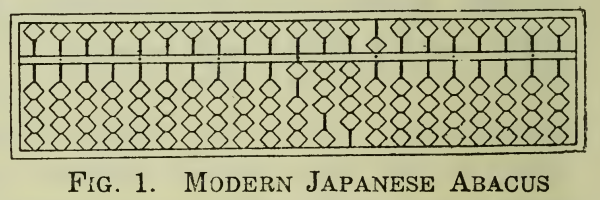
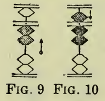

Title: Um solver ad hoc de problemas aritméticos usando ábaco japonês em Lisp
Date: 2026-04-11 18:00
Category: Programação


Um dos meus hiperfocos mais recentes é o [ábaco japonês--ou "soroban"--](https://en.wikipedia.org/wiki/Soroban), um instrumento de artimética instrumental que se desenvolveu no Japão com base no ábaco chinês--ou "suanpan"--, a partir da importação deste para o Japão, em meados do século XIV.

Comecei a aprender as operações aritméticas básicas no soroban ao longo da última semana e, nesse processo, verifiquei que seria útil ter um solver: um programa para me ajudar a verificar resultados de sequências de adição e subtração, incluindo resultados parciais. Resolvi unir o agradável ao agradável. Como eu já vinha realizando uma vontade antiga e começando a estudar [programação funcional](https://en.wikipedia.org/wiki/Functional_programming) em [Lisp](https://en.wikipedia.org/wiki/Lisp_(programming_language)), quis me desafiar com o projeto de fim de semana de escrever um programa em Lisp para cumprir esse propósito.

Este texto relata essa experiência, a iniciar por uma descrição do funcionamento básico do soroban, passando pelos detalhes de implementação do solver referido, e exemplificando sua utilização para resolver um problema similar aos encontrados em exames de graduação em soroban de associações de ábaco japonesas.

### Funcionamento básico do soroban

O soroban é um instrumento caracterizado por uma moldura dividida longitudinalmente por um travessão em duas seções: uma mais estreita--acima--e uma mais larga--abaixo. Pequenas varas atravessam essa estrutura da base ao topo, sendo que em cada vara são colocadas cinco contas. Na seção de cima da moldura--mais estreita--, coloca-se uma única conta, ao passo que na seção de baixo da moldura--mais larga--, coloca-se quatro contas. A figura abaixo, extraída de [um livro de 1954 chamado _The Japanese Abacus: Its Use and Theory_, de Takashi Kojima](https://archive.org/details/japaneseabacusit00koji/page/n7/mode/2up), ajuda a visualizar esse instrumento:



Cada vara é usada para representar um algarismo, de acordo com a maneira como as contas dela são posicionadas. As contas da seção de cima--chamadas de "go-dama"--representam 5 unidades. As contas da seção de baixo--chamadas de "ichi-dama"--representam 1 unidade cada. Juntas, as quatro ichi-damas de uma vara totalizam 4 unidades. Para que o valor de uma conta seja levado em consideração na composição do algarismo representado pela vara em que ela está, é preciso que ela seja trazida em direção do centro do ábaco, de forma a encostá-la no travessão que secciona longitudinalmente a moldura do ábaco.

O algarismo representado por uma vara é dado pela soma dos valores das contas dessa vara que se encontram encostadas no travessão. A figura abaixo, também extraída de _The Japanese Abacus: Its Use and Theory_, ajuda a entender essa ideia:



Primeiro, à esquerda, a vara representa o algarismo 2, uma vez que duas ichi-damas estão encostadas no travessão e cada ichi-dama vale 1 unidade. À direita, ao encostar a go-dama no travessão, como ela vale 5 unidades, a vara passa a representar o algarismo 7--i.e. 2 + 5.

Cada vara do soroban serve à representação de uma ordem: as unidades são representadas pela vara mais à direita, as dezenas pela vara imediatamente à esquerda desta, as centenas pela vara imediatamente à esquerda desta, e assim por diante, de forma que a quantidade de ordens representáveis no ábaco é igual ao número de varas que ele possui. Caso haja a necessidade de algarismos fracionários, é possível deslocar a ordem das unidades algumas varas à esquerda, de maneira que as varas mais à direita possam representá-los.

Para validar o entendimento do raciocínio construído até aqui, é possível utilizar a primeira figura deste texto: se nenhuma vara estivesse sendo utilizada para representar algarismos fracionários, o ábaco na figura registraria o valor 13.450.000.000.

Como qualquer outra ferramenta, a única maneira de adquirir maestria na utilização do soroban é praticando. Um exercício muito comum, similar ao encontrado em exames de graduação de associações japonesas, é realizar uma série de operações aritméticas de soma e subtração com base em uma sequência de números dada. Uma sequência poderia ser, por exemplo:

> 56, 41, 94, 60, -15, 32, -63, 44

E o resultado esperado poderia ser calculado fazendo: 56 + 41 + 94 + 60 - 15 + 32 - 63 + 44 = 249. Foge ao escopo deste texto discutir os detalhes de operação do soroban que permitiriam a solução dessa sequência, mas as operações aritméticas necessárias podem ser realizadas através da aplicação de uma série de regras de manipulação baseadas na decomposição de cada número da sequência em seus componentes de ordem, o que resulta em uma sequência de operações expandida. Para a sequência acima:

> 50 + 6 + 40 + 1 + 90 + 4 + 60 - 10 -5 + 30 + 2 - 60 - 3 + 40 + 4

Após a operação de cada componente da sequência, o soroban apresenta uma configuração diferente, representando o resultado parcial da solução da sequência até aquele ponto. Caso algum resultado parcial seja diferente do esperado, isso compromete todo o restante da solução, e o resultado final não corresponderá ao esperado--salvo pela possibilidade da introdução de um novo erro que leve ao resultado esperado por coincidência.

Parte do processo de aprendizado do soroban é adquirir familiaridade com os padrões de manipulação do ábaco ao operar componentes de sequências como essa. Constatei que a possibilidade de visualizar como a configuração do ábaco deveria estar entre as operações de uma sequência é de grande ajuda, por permitir a detecção de erros que, para um iniciante--como eu--, podem não ser tão óbvios. É aqui que o solver em Lisp entra na história.

### Implementação do solver em Lisp

Um dos maiores remorsos de minha formação em engenharia de computação é nunca ter tido a oportunidade de ter sido exposto à programação funcional de maneira formal. A curiosidade era tanta que eu sempre soube que, um dia, acabaria recorrendo à autoinstrução para preencher essa lacuna. Há relativamente pouco tempo, venho estudando esse paradigma de programação em Lisp. É preciso notar que o foco deste texto não é a exploração dos detalhes da linguagem Lisp, tampouco do paradigma funcional, mas tão somente discutir os detalhes relacionados à implementação de um programa solver ad hoc para sequências de soma e subtração no soroban, muito como exercício de fixação de meu próprio aprendizado e, portanto, não deve ser utilizado como referência para absolutamente nada.

Outra ressalva importante, caso o leitor não esteja familiarizado com Lisp, é que essa é uma linguagem de programação bastante antiga--da década de 50--e, assim como C, deu origem a diversos dialetos. A quantidade de implementações de linguagens Lisp-like é muito grande. Caso o leitor queira executar o código aqui apresentado, tenha em mente que eu o escrevi em [Common Lisp](https://en.wikipedia.org/wiki/Common_Lisp)--padronização de Lisp da década de 90. Mais especificamente, utilizei a implementação [Steele Bank Common Lisp (SBCL)](https://www.sbcl.org/).

O primeiro passo de implementação foi definir uma estrutura de dados para representar o soroban. Fiz isso criando uma função chamada `abacus`, cujo único argumento, `n`, representa o valor registrado no ábaco:

```lisp
(defun abacus (n))
```

Além do valor de `n`, é fundamental registrar os valores individuais de cada vara--i.e. os dígitos que compõem o valor registrado no ábaco. Optei por fazer isso usando uma property list (plist) com dois fields, `:value` e `:rods`:

```lisp
(defun abacus (n)
  (list
   :value n
   :rods (digits n)))
```

Assim, `:value` contém o valor registrado no ábaco. `:rods`, por sua vez, é uma subestrutura de dados que contém os dígitos que compõem `:value`. `:rods` é formada pela decomposição de `n`. Essa decomposição é feita em uma função que chamei de `digits`, a saber:

```lisp
(defun digits (n)
  (map 'list #'digit-char-p
       (write-to-string n)))
```

Primeiro, `digits` converte `n` para string. Em seguida, cada caractere é mapeado para um dígito numérico com `digit-char-p`. A notação `#'` significa que a própria função `digit-char-p` é argumento de `map`. Os resultados do mapeamento são coletados em uma lista, que por sua vez é retornada--o uso de `'` antes de `list` previne que o Lisp tente avaliar a palavra `list` como código, tratando-a apenas como uma referência ao tipo de dado.

A essa altura, o próximo passo natural era implementar uma rotina capaz de realizar somas e subtrações. Para isso, implementei a função `add-sub`:

```lisp
(defun add-sub (a n)
  (abacus (+ n (getf a :value))))
```

`add-sub` espera dois argumentos, a saber: `a`, um `abacus`, e `n`, um número a ser somado ao valor registrado em `a`. A função simplesmente invoca `abacus`, fornecendo como argumento a soma de `n` com o valor registrado em `a` e retornando, em seguida, o `abacus` resultante da invocação. As funções disponíveis até aqui já permitiriam a realização de operações de soma e subtração. Antes, no entanto, seria interessante criar uma função capaz de operar uma sequência de valores, em consonância com a natureza do exercício de soroban já discutido. Implementei a função `add-sub-seq` para essa finalidade. Embora Lisp seja plenamente capaz de implementar lógica iterativa, como o meu foco aqui era exercitar a implementação de estruturas funcionais, optei por uma versão recursiva da rotina:

```lisp
(defun add-sub-seq (a s)
  (when s
    (let ((new-a (add-sub a (car s))))
      (add-sub-seq new-a (cdr s)))))
```

`add-sub-seq` espera dois argumentos: `a`, um `abacus`, e `s`, uma lista representando uma sequência de valores. A ideia da função é muito simples: primeiro, ela testa se a lista `s` não está vazia--essa é a condição de continuidade de recursão. Caso a lista contenha elementos, a função define `new-a`, um novo `abacus` que registra a soma do valor registrado em `a` com o primeiro elemento de `s`. Depois disso, a função invoca a si mesma, recursivamente, fornecendo `new-a` e `(cdr s)`--i.e. uma sublista constituída por todos os elementos de `s` menos o primeiro. Como `add-sub-seq` retorna um `abacus`, o que resulta da recursão é um `abacus` que registra a soma de todos os valores da lista `s` original.

O código já poderia ser utilizado para resolver sequências de operações, mas ele forneceria apenas o resultado final da sequência, sem cumprir a finalidade de auxiliar na visualização de resultados parciais da solução. Para resolver isso, criei as funções `print-abacus`, `print-rods` e `print-rod`:

```lisp
(defun print-abacus (a)
  (format t "Value: ~A~%" (getf a :value))
  (format t "Rods:")
  (print-rods (getf a :rods) nil)
  (format t "~%"))

(defun print-rods (r n)
  (if n (print-rod n) (format t "~%"))
  (when r
    (let ((new-r (butlast r 1)))
      (print-rods new-r (first (reverse r))))))

(defun print-rod (n) 
  (format t
	  (if (< n 5) "O-" "-O"))
  (format t "|")
  (format t "~A"
	  (concatenate 'string
		       (subseq "OOOO" 0 (mod n 5))
		       "-"
		       (subseq "OOOO" (mod n 5) 4)))
  (format t "~%"))
```

`print-rod` implementa lógica capaz de representar graficamente uma vara do soroban na tela usando apenas caracteres ASCII. `print-abacus` mostra na tela o valor registrado em um `abacus` `a` recebido como argumento e, em seguida, invoca `print-rods`, fornecendo a lista de dígitos que compõem o valor registrado em `a`--i.e. `:rods`--e `nil`. `print-rods` recebe esses argumentos como `r` e `n` e implementa lógica recursiva para mostrar na tela uma representação gráfica do ábaco, através de invocações à função `print-rod`. Isso ocorre da seguinte forma: primeiro, `print-rods` testa `n`. Caso esse valor seja diferente de `nil`, a função invoca `print-rod` fornecendo o argumento `n`. Caso `n` seja `nil`, a função simplesmente quebra a linha de saída. É relevante observar que, na primeira invocação de `print-rods`, `n` é `nil`, resultando apenas em uma quebra de linha.

Em seguida, `print-rods` testa se a lista `r` não está vazia--essa é a condição de continuidade de recursão. Caso `r` não esteja vazia, a função define `new-r`, contendo todos os dígitos de `r`, menos o último--que é o dígito menos significativo do número registrado no ábaco. Esse mesmo dígito menos significativo de `r` é passado como argumento, junto com `new-r`, em uma chamada recursiva a `print-rods`. Como `n` nessa chamada não é `nil`, o resultado é que uma representação gráfica do dígito menos significativo do valor registrado no ábaco é mostrada na tela. As invocações recursivas subsequentes dessa função resultam na representação gráfica do ábaco, do dígito menos significativo para o dígito mais significativo.

Podemos usar o código produzido até esse ponto para resolver a sequência apresentada anteriormente--i.e.:

```lisp
(defvar s (list 56 41 94 60 -15 32 -63 44))
(defvar a (abacus 0))

(add-sub-seq a s)
```

Essa invocação produziria a seguinte saída:

```lisp
Value: 0
Rods:
O-|-OOOO

Value: 56
Rods:
-O|O-OOO
-O|-OOOO

Value: 97
Rods:
-O|OO-OO
-O|OOOO-

Value: 191
Rods:
O-|O-OOO
-O|OOOO-
O-|O-OOO

Value: 251
Rods:
O-|O-OOO
-O|-OOOO
O-|OO-OO

Value: 236
Rods:
-O|O-OOO
O-|OOO-O
O-|OO-OO

Value: 268
Rods:
-O|OOO-O
-O|O-OOO
O-|OO-OO

Value: 205
Rods:
-O|-OOOO
O-|-OOOO
O-|OO-OO

Value: 249
Rods:
-O|OOOO-
O-|OOOO-
O-|OO-OO
```

Com isso, já há recursos suficientes para acompanhar os resultados parciais da solução de uma sequência de operações. Entretanto, o código ainda não é capaz de lidar com os passos intermediários da solução de cada operação da sequência, mas tão somente de apresentar os resultados finais de cada operação. A operação do soroban é baseada na decomposição de cada valor da sequência em componentes de ordem, conforme já exposto. Assim, o próximo passo natural é implementar rotinas de decomposição e integrá-las ao código já existente. Comecei pela função `components`, que decompõe um número em componentes de ordem de maneira recursiva:

```lisp
(defun components (n c)
  (if (/= n 0)
      (let* ((sig (if (< n 0) -1 1))  
	     (abs-n (abs n))
	     (s (write-to-string abs-n))
	     (l (length s))
	     (next-c (* sig
			(parse-integer (subseq s 0 1))
			(expt 10 (- l 1)))))
	(components (- n next-c) (append c (list next-c))))
  c))
```

`components` espera dois argumentos: `n`, um número, e `c`, uma lista de componentes, que é `nil` na primeira chamada à função. A função é baseada em um branch que testa se o valor de `n` é diferente de 0. Se esse teste resultar em `nil`--falso--, a função simplesmente produz a lista `c` recebida como argumento. Isso denota o final da decomposição do número e a condição de parada da recursão. Por outro lado, se `n` for igual a 0 e o teste resultar em `t`--true--, uma série de variáveis locais é declarada, a saber:

- `sig`: o sinal de `n`;
- `abs-n`: o valor absoluto de `n`;
- `s`: `abs-n` convertido para string; e
- `l`: o comprimento de `s`.

Por fim, a função declara uma última variável local, `next-c`, que representa o próximo componente de ordem de `n`, que é dado pelo produto entre:

- `sig`;
- O valor numérico do primeiro caractere de `s`; e
- A potência de 10 referente à posição do componente de ordem, calculada elevando 10 à `(- l 1)`-ésima potência.

Por fim, a função invoca a si mesma, recursivamente, passando como argumentos a diferença entre `n` e `next-c`--i.e. `n` menos o componente de ordem calculado no nível de recursão atual--e a concatenação de `c` com `next-c`--o componente de ordem calculado no nível de recursão atual. Disso, resulta que chamadas recursivas subsequentes construirão gradativamente a lista completa de componentes de ordem do argumento `n` original, até o nível de recursão em que `(/= n 0)` é `nil` e a recursão retorna.

Assim, `components` é capaz de decompor um número em seus componentes de ordem. A última peça faltante era uma função capaz de utilizar `components` para expandir uma sequência dada de números nos componentes de ordem de todos os seus elementos. Implementei a função `expand-seq` para isso:

```lisp
(defun expand-seq (s)
  (when s
    (append
     (components (first s) (list))
     (expand-seq (cdr s)))))
```

O comportamento de `expand-seq` é muito simples: a função espera como argumento `s`--uma lista de números. Em seguida, ela testa `s` para ver se a sequência está vazia. Caso a sequência não esteja vazia, a função realiza a concatenação dos componentes do primeiro elemento de `s`--obtidos através de uma chamada a `components`--com o resultado de uma chamada recursiva a si própria, passando como argumento uma sublista constituída por todos os elementos de `s` menos o primeiro, resultante de `(cdr s)`.

De maneira a integrar `components` e `expand-seq` ao código que eu já tinha, simplesmente invoquei `expand-seq` passando a sequência original do problema a resolver, e passando a sequência resultante disso a `add-sub-seq`. Além disso, adicionei algumas linhas de formatação de saída para consolidar o código do meu programa principal:

```lisp
(defvar s (list 56 41 94 60 -15 32 -63 44))

(defvar e (expand-seq s))
(defvar a (abacus 0))

(format t ";;;;;;;;;; SOROBAN SOLVER ;;;;;;;;;;~%~%")
(format t "Problem list: ~A~%" s)
(format t "Expanded component list: ~A~%~%" e)
(format t "Solution steps:~%~%")

(add-sub-seq a e)
```

O resultado da execução desse código é uma listagem de todos os passos intermediários de solução do problema de adição e subtração no soroban definido pela sequência de números na lista `s`. A versão final comentada do código está disponível [no meu Codeberg](https://codeberg.org/vasconcedu/soroban-solver/src/branch/master/soroban.lisp). Executá-la produz a saída abaixo:

```lisp
;;;;;;;;;; SOROBAN SOLVER ;;;;;;;;;;

Problem list: (56 41 94 60 -15 32 -63 44)
Expanded component list: (50 6 40 1 90 4 60 -10 -5 30 2 -60 -3 40 4)

Solution steps:

Value: 0
Rods:
O-|-OOOO

Value: 50
Rods:
O-|-OOOO
-O|-OOOO

Value: 56
Rods:
-O|O-OOO
-O|-OOOO

Value: 96
Rods:
-O|O-OOO
-O|OOOO-

Value: 97
Rods:
-O|OO-OO
-O|OOOO-

Value: 187
Rods:
-O|OO-OO
-O|OOO-O
O-|O-OOO

Value: 191
Rods:
O-|O-OOO
-O|OOOO-
O-|O-OOO

Value: 251
Rods:
O-|O-OOO
-O|-OOOO
O-|OO-OO

Value: 241
Rods:
O-|O-OOO
O-|OOOO-
O-|OO-OO

Value: 236
Rods:
-O|O-OOO
O-|OOO-O
O-|OO-OO

Value: 266
Rods:
-O|O-OOO
-O|O-OOO
O-|OO-OO

Value: 268
Rods:
-O|OOO-O
-O|O-OOO
O-|OO-OO

Value: 208
Rods:
-O|OOO-O
O-|-OOOO
O-|OO-OO

Value: 205
Rods:
-O|-OOOO
O-|-OOOO
O-|OO-OO

Value: 245
Rods:
-O|-OOOO
O-|OOOO-
O-|OO-OO

Value: 249
Rods:
-O|OOOO-
O-|OOOO-
O-|OO-OO
```

### Conclusão

Fiquei feliz com os resultados obtidos, mas é evidente que eu ainda tenho um caminho muito longo a percorrer em programação funcional. A melhor parte desse exercício é que agora eu tenho uma ferramenta bastante interessante para me ajudar a melhorar no soroban, além de ter produzido um recurso que pode ser útil a todos os outros inúmeros hobbystas de ábaco japonês e programação funcional em Lisp--com a devida licença sarcástica.

É isso.

_Happy hacking._